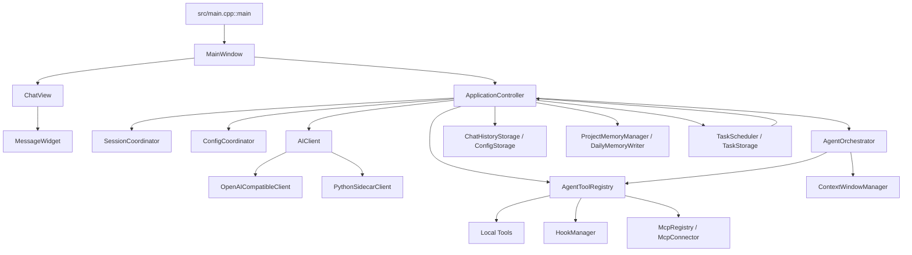

# CodeXX codebase-memory-mcp 调用关系分析

> 最后更新：2026-07-04
> MCP 项目名：`D-C1-CodeXX`
> MCP 可执行文件：`D:\MCP\codebase-memory-mcp\codebase-memory-mcp.exe`
> 当前索引：411 文件，4096 节点，10495 条边
> 用途：给后续 Agent 提供调用关系入口、影响分析方法和开发前后检查规则。

---

## 1. 使用原则

`codebase-memory-mcp` 用来回答结构性问题，例如“某个类在哪里定义”“哪些函数是复杂热点”“某个模块大致调用哪些服务”。它不替代源码阅读和测试。

在 CodeXX 中推荐分工：

| 场景 | 优先工具 |
|------|----------|
| 找类、函数、模块、调用关系、复杂度热点 | `codebase-memory-mcp` |
| 找字符串、错误文本、配置值、非代码片段 | `rg` |
| 核对具体实现、边界条件、注释语义 | 直接读源码 |
| 修改后影响范围判断 | `detect_changes` + 相关测试 |

注意：当前版本对 Qt/C++ 成员函数的 callee 识别不完整，部分方法能识别复杂度、入度、文件位置，但 `trace_path` 可能返回空 callee。因此调用关系结论必须结合源码核对。

---

## 2. 索引配置

仓库根目录已加入 `.cbmignore`，用于过滤构建产物和本地缓存，避免 `build-release`、`release`、`__pycache__` 等生成文件污染图。

当前全量索引命令：

```powershell
D:\MCP\codebase-memory-mcp\codebase-memory-mcp.exe cli index_repository '{"repo_path":"D:/C1/CodeXX"}'
```

当前状态确认命令：

```powershell
D:\MCP\codebase-memory-mcp\codebase-memory-mcp.exe cli list_projects
D:\MCP\codebase-memory-mcp\codebase-memory-mcp.exe cli index_status '{"project":"D-C1-CodeXX"}'
```

当前期望状态：

```json
{"project":"D-C1-CodeXX","nodes":4096,"edges":10495,"status":"ready"}
```

节点和边数量会随源码、文档、测试变化而变化，状态为 `ready` 比具体数字更重要。

---

## 3. 常用命令

### 3.0 token 节省用法

后续 Agent 需要先用 MCP 缩小上下文，再读取源码。

推荐顺序：

1. 用 `index_status` 确认图可用。
2. 用 `search_graph` 找类、方法、文件和热点。
3. 用 `trace_path`、`query_graph` 或 `detect_changes` 判断影响范围。
4. 只读取 MCP 命中的源码、直接调用方和测试。
5. 如果 MCP 对 Qt/C++ 成员函数返回不完整，再用 `rg` 精确核对。

不推荐：

- 为了“掌握项目”直接读取整个 `src/`。
- 为了找一个入口读取所有 `docs/`。
- 在 MCP 已给出明确节点后继续大范围全文搜索。

### 3.1 查询架构概览

```powershell
D:\MCP\codebase-memory-mcp\codebase-memory-mcp.exe cli get_architecture '{"project":"D-C1-CodeXX","aspects":["all"]}'
```

用于快速查看：

- 入口点：`src/main.cpp::main`、`python/agent_sidecar/agent_sidecar/server.py::main`
- 主要包：`app`、`ui`、`tools`、`services`、`storage`、`hooks`、`skills`、`mcp`、`scheduler`
- 热点函数：高 fan-in 或高复杂度节点

### 3.2 查找类或方法

```powershell
D:\MCP\codebase-memory-mcp\codebase-memory-mcp.exe cli search_graph '{"project":"D-C1-CodeXX","label":"Class","name_pattern":".*ApplicationController.*","limit":10}'
```

```powershell
D:\MCP\codebase-memory-mcp\codebase-memory-mcp.exe cli search_graph '{"project":"D-C1-CodeXX","label":"Method","name_pattern":".*handleRequestFinished.*","limit":10}'
```

### 3.3 查询调用路径

```powershell
D:\MCP\codebase-memory-mcp\codebase-memory-mcp.exe cli trace_path '{"project":"D-C1-CodeXX","function_name":"handleRequestFinished","direction":"both","depth":2}'
```

如果结果为空，先用 `search_graph` 找到精确名称，再读源码确认。

### 3.4 查询任意图关系

```powershell
D:\MCP\codebase-memory-mcp\codebase-memory-mcp.exe cli query_graph '{"project":"D-C1-CodeXX","query":"MATCH (f)-[:CALLS]->(g) WHERE f.file_path STARTS WITH \"src/\" AND g.file_path STARTS WITH \"src/\" RETURN f.name, f.file_path, g.name, g.file_path LIMIT 40"}'
```

### 3.5 开发后影响分析

```powershell
D:\MCP\codebase-memory-mcp\codebase-memory-mcp.exe cli detect_changes '{"project":"D-C1-CodeXX"}'
```

如果改动涉及源码结构、调用链、类职责或主要流程，完成后重新索引：

```powershell
D:\MCP\codebase-memory-mcp\codebase-memory-mcp.exe cli index_repository '{"repo_path":"D:/C1/CodeXX"}'
```

---

## 4. 开发前后硬规则

开发前必须确认：

1. `list_projects` 能看到 `D-C1-CodeXX`。
2. `index_status` 返回 `ready`。
3. 已用 `search_graph` 或 `get_architecture` 找到本次任务相关模块。
4. 任务卡中记录本次参考的 MCP 查询结论。

开发过程中必须更新：

- 如果发现实际调用关系和本文件不一致，先更新本文件再继续。
- 如果任务跨会话，更新 `docs/DEVELOPMENT_PLAN.md` 的状态或备注。
- 如果改动改变模块边界，更新 `docs/架构优化方向.md` 或新增专题文档。

开发完成后必须执行：

1. `detect_changes` 查看影响范围。
2. 如果改了 `src/`、`python/`、`tests/` 或核心文档，重新执行 `index_repository`。
3. 如果调用链、入口、职责边界变化，更新本文件。
4. 在最终说明中写明 MCP 是否已更新。

---

## 5. 当前调用关系总览

CodeXX 的主调用方向可以理解为：



核心结论：

- `MainWindow` 负责桌面入口和用户动作，业务分发交给 `ApplicationController`。
- `ApplicationController` 是主控胶水层，连接 UI、会话、AI、Agent、工具、存储、调度。
- `AgentOrchestrator` 保存 Agent 循环状态、构造下一轮 prompt、执行计划并汇报工具结果。
- `AgentToolRegistry` 是工具入口，负责默认工具、MCP 外部工具、Hook 执行和结果封装。
- `OpenAICompatibleClient` 是当前直接模型调用路径。
- `PythonSidecarClient` 是后续 Python 能力层入口，不接管 C++ Agent 主循环。
- `ChatHistoryStorage`、`ConfigStorage`、`ProjectMemoryManager`、`DailyMemoryWriter` 负责持久化和记忆上下文。
- `TaskScheduler` 触发定时任务后回到 `ApplicationController::sendAgentLoopMessage`，复用 Agent 主循环。

---

## 6. 关键入口和源码位置

| 调用点 | 文件位置 | MCP 结论 |
|--------|----------|----------|
| `MainWindow::sendCurrentMessage` | `src/ui/MainWindow.cpp:853` | UI 发送入口，根据 Agent 模式分发到普通聊天或 Agent |
| `ApplicationController::sendMessage` | `src/app/ApplicationController.cpp:340` | 普通聊天入口，写入用户消息并启动 AI 请求 |
| `ApplicationController::regenerateLastResponse` | `src/app/ApplicationController.cpp` | 成功助手回复的重新生成入口，不依赖失败重试标记 |
| `ApplicationController::sendAgentLoopMessage` | `src/app/ApplicationController.cpp:620` | Agent 连续循环入口，初始化 Agent 上下文和第一轮请求 |
| `ApplicationController::continueAgentLoop` | `src/app/ApplicationController.cpp:722` | 启动下一轮 Agent AI 请求 |
| `ApplicationController::executeAgentToolDefinition` | `src/app/ApplicationController.cpp:867` | 工具执行结果封装为 Agent 步骤和待回传结果 |
| `ApplicationController::executeAgentToolCalls` | `src/app/ApplicationController.cpp:948` | 批量解析和执行模型返回的 tool call |
| `ApplicationController::handleRequestFinished` | `src/app/ApplicationController.cpp:1164` | AI 响应完成后的核心分流点，复杂度 30、认知复杂度 73 |
| `ApplicationController::onScheduledTaskTriggered` | `src/app/ApplicationController.cpp:1671` | 定时任务触发后进入 Agent 消息路径 |
| `AgentOrchestrator::createSubAgentTool` | `src/app/AgentOrchestrator.cpp` | `agent.explore` 子 Agent 工具，使用独立 AIClient，避免主会话信号串扰 |
| `AgentOrchestrator::executePlanAndReportToChat` | `src/app/AgentOrchestrator.cpp:393` | 计划步骤执行，复杂度 18、认知复杂度 39 |
| `AgentLoopController::executeLoop` | `src/app/AgentLoopController.cpp` | 独立可测循环实现，复杂度 43、认知复杂度 105 |
| `AgentToolRegistry::execute` | `src/tools/AgentToolRegistry.cpp:576` | 工具注册表统一执行入口 |
| `AgentToolRegistry::registerExternalTools` | `src/tools/AgentToolRegistry.cpp:640` | MCP 外部工具转内部工具定义 |
| `OpenAICompatibleClient::sendChatWithTools` | `src/services/OpenAICompatibleClient.cpp:67` | OpenAI-compatible 工具调用请求入口 |
| `PythonSidecarClient::send` | `src/services/PythonSidecarClient.cpp:65` | C++ 到 Python sidecar 的 JSONL 请求入口 |
| `TaskScheduler::tick` | `src/scheduler/TaskScheduler.cpp:227` | 定时任务扫描和触发 |
| `HookManager::executeHooks` | `src/hooks/HookManager.cpp:46` | Hook 执行入口 |
| `McpRegistry::callTool` | `src/mcp/McpRegistry.cpp:66` | 外部 MCP 工具调用入口 |

---

## 7. 主流程拆解

### 7.1 普通聊天

```text
MainWindow::sendCurrentMessage
  -> ApplicationController::sendMessage
  -> SessionCoordinator 写入用户消息
  -> OpenAICompatibleClient::sendChat
  -> OpenAICompatibleClient::handleReadyRead / handleFinished
  -> ApplicationController::handleRequestFinished
  -> ChatHistoryStorage 保存会话
  -> MainWindow / ChatView / MessageWidget 渲染
```

普通聊天不进入工具执行循环，除非后续被统一消息路径或工具调用路径接管。

### 7.2 Agent 连续循环

```text
MainWindow::sendCurrentMessage
  -> ApplicationController::sendAgentLoopMessage
  -> AgentOrchestrator 初始化循环状态
  -> AgentOrchestrator::buildNextLoopPrompt
  -> OpenAICompatibleClient::sendChatWithTools
  -> ApplicationController::handleRequestFinished
  -> executeAgentToolCalls / executeAgentToolDefinition
  -> AgentToolRegistry::execute
  -> HookManager::executeHooks
  -> 本地工具或 MCP 外部工具
  -> publishAgentToolResults
  -> continueAgentLoopWithToolResults
  -> continueAgentLoop
```

该流程是当前项目实际主循环，不能再引入第二套 Agent 决策流程。

### 7.3 计划执行

```text
AgentPlanParser / AgentToolCallPlanBuilder
  -> AgentOrchestrator::executePlanAndReportToChat
  -> AgentToolRegistry::execute
  -> 工具结果追加为 Agent step
  -> 失败或重复动作写入 observation
```

计划执行适合“先生成步骤再执行”的场景，连续循环适合“模型边观察边继续”的场景。

### 7.4 Python 能力层

```text
C++ PythonSidecarClient
  -> QProcess 启动 python -m agent_sidecar
  -> JSONL request
  -> protocol.handle_line
  -> capabilities.count_tokens / capabilities.chat
  -> JSONL response
```

Python 能力层只提供能力，不直接执行本机高权限工具，也不接管 Agent 主循环。

### 7.5 消息重新生成与子 Agent

```text
右键 Assistant 消息
  -> MainWindow::onMessageRegenerateRequested
  -> ApplicationController::regenerateLastResponse
  -> 移除最后一条 assistant 回复
  -> startAssistantRequest(上一条 user 内容)
```

成功回复重新生成和失败重试是两条路径：失败重试使用 `retryLastRequest()`，成功回复重新生成使用 `regenerateLastResponse()`。

```text
Agent tool: agent.explore
  -> AgentOrchestrator::createSubAgentTool
  -> createIsolatedSubAgentClient
  -> Direct: OpenAICompatibleClient
  -> Sidecar: PythonSidecarAIClient，启动失败则回退 OpenAICompatibleClient
  -> 子 Agent 只使用只读工具上下文
```

子 Agent 不复用主 `m_aiClient`，否则它的 `textDeltaReceived/requestFinished/requestFailed` 会进入主 `ApplicationController`，污染当前聊天或 Agent 主循环。

---

## 8. MCP 发现的热点和风险

| 节点 | MCP 指标 | 解释 |
|------|----------|------|
| `DailyMemoryWriter::append` | fan-in 76 | 记忆写入公共路径，修改时要重点跑 memory 相关测试 |
| `RequestErrorCategory::toString` | fan-in 54 | 错误分类展示公共路径，修改会影响日志和 UI 文案 |
| `ToolResult::failure` | fan-in 41 | 工具失败返回公共路径，影响 Agent 观察和测试 |
| `ToolResult::success` | fan-in 40 | 工具成功返回公共路径，影响 30+ 工具 |
| `ApplicationController::handleRequestFinished` | complexity 30 / cognitive 73 | AI 响应完成后的核心分流点，最容易产生流程回归 |
| `AgentLoopController::executeLoop` | complexity 43 / cognitive 105 | 独立循环实现复杂，修改前必须读对应测试 |
| `AgentOrchestrator::executePlanAndReportToChat` | complexity 18 / cognitive 39 | 计划执行和工具结果汇报核心路径 |
| `PythonSidecarClient::start` | fan-in 18 | sidecar 生命周期入口，涉及 QProcess 和超时 |

开发建议：

- 改 `ApplicationController::handleRequestFinished` 前，先查 `tests/app/AgentLoopExecutionTest.cpp` 和 `tests/services/ChatToolExecutionTest.cpp`。
- 改工具注册和执行前，先查 `tests/tools/AgentToolRegistryTest.cpp`、`tests/services/ChatToolExecutionTest.cpp`。
- 改记忆系统前，先查 `tests/memory/ProjectMemoryManagerTest.cpp` 和 `tests/tools/ProjectMemoryServiceTest.cpp`。
- 改 sidecar 前，先查 `tests/services/PythonSidecarClientTest.cpp`、`tests/services/PythonSidecarProtocolTest.cpp`、`python/agent_sidecar/tests/test_protocol.py`。

---

## 9. 文档更新规则

以下情况必须更新本文件：

- 新增或删除主流程入口。
- `ApplicationController`、`AgentOrchestrator`、`AgentToolRegistry`、`OpenAICompatibleClient`、`PythonSidecarClient` 的职责边界变化。
- Agent 循环从 `handleRequestFinished` 迁移或拆分。
- 新增独立能力层、工具层、调度层或 MCP 接入路径。
- MCP 索引配置变化，例如 `.cbmignore`、项目名、安装路径、自动索引策略变化。

更新本文件后，执行：

```powershell
D:\MCP\codebase-memory-mcp\codebase-memory-mcp.exe cli index_repository '{"repo_path":"D:/C1/CodeXX"}'
D:\MCP\codebase-memory-mcp\codebase-memory-mcp.exe cli index_status '{"project":"D-C1-CodeXX"}'
```
