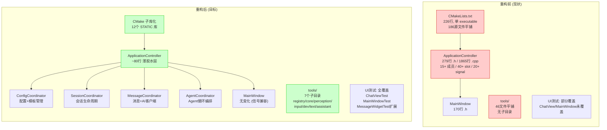
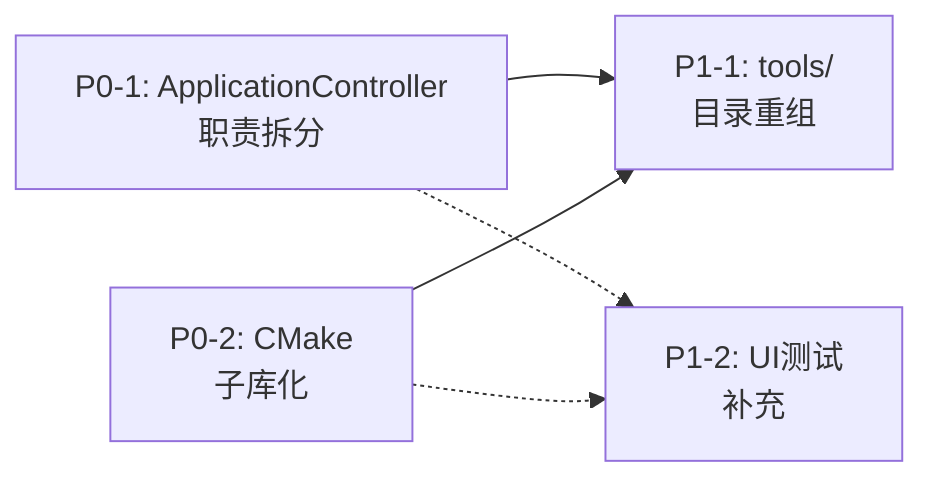
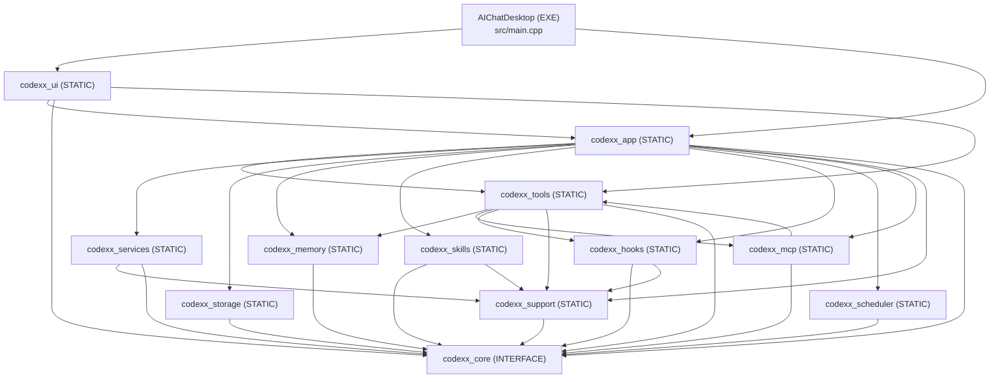
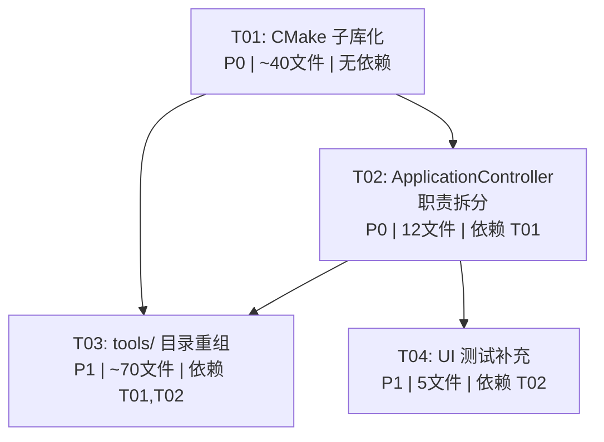

# CodeXX 重构架构设计文档

> **作者**: Bob (Architect)  
> **版本**: 1.0  
> **日期**: 2025-06-04  
> **类型**: 内部重构 — 零外部行为变更

---

## 目录

1. [系统设计总览](#1-系统设计总览)
2. [P0-1: ApplicationController 职责拆分](#2-p0-1-applicationcontroller-职责拆分)
3. [P0-2: CMake 子库化](#3-p0-2-cmake-子库化)
4. [P1-1: tools/ 目录重组](#4-p1-1-tools-目录重组)
5. [P1-2: UI 测试补充](#5-p1-2-ui-测试补充)
6. [任务分解](#6-任务分解)
7. [风险点与回滚策略](#7-风险点与回滚策略)
8. [依赖包列表](#8-依赖包列表)
9. [共享知识](#9-共享知识)

---

## 1. 系统设计总览

### 1.1 重构前后架构对比



### 1.2 四项改进依赖关系



- **实线箭头** = 强依赖（需要先完成）
- **虚线箭头** = 弱依赖（建议先完成，使后续更易验证）
- **P0-1 和 P0-2 相互独立**，可并行推进
- **P1-1 依赖 P0-2**：子库化后 tools 的 include 路径更容易验证
- **P1-2 可独立进行**，但建议在 P0-1/P0-2 完成后，因为 Coordinator 拆分后 UI 测试更容易写

### 1.3 推荐实施顺序

```
Phase 1: T01 (CMake 子库化基础设施)
         │
         ├── Phase 2a: T02 (ApplicationController 拆分)  ─┐
         │                                                  │
         └── Phase 2b: P0-2 收尾                            │
                                                            │
         Phase 3: T03 (tools/ 目录重组)  ←─────────────────┘
         
         Phase 4: T04 (UI 测试补充) ← 可与 Phase 3 并行
```

---

## 2. P0-1: ApplicationController 职责拆分

### 2.1 现状分析

ApplicationController (279 行 `.h` + 1865 行 `.cpp`) 的职责可按领域分为：

| 职责域 | 相关成员变量 | 相关 public slots | 相关 signals | 相关 private 方法 |
|--------|------------|-------------------|-------------|------------------|
| **配置管理** | `m_config`, `m_configStorage`, `m_promptTemplates`, `m_promptTemplateStorage` | `saveConfig`, `savePromptTemplates` | `configChanged`, `promptTemplatesChanged` | — |
| **会话管理** | `m_session`, `m_sessionSummaries`, `m_sessionListFilter`, `m_chatHistoryStorage`, `m_sessionSearchQuery`, `m_historyAvailable` | `startNewChat`, `switchToSession`, `deleteCurrentSession`, `renameCurrentSession`, `searchSessions`, `setSessionListFilter`, `toggleCurrentSessionFavorite`, `toggleCurrentSessionArchived`, `saveCurrentSession`, `editCurrentMessage`, `truncateCurrentSessionFrom`, `createMessageBranch` | `sessionListChanged`, `sessionListFilterChanged`, `currentSessionChanged`, `currentChatCleared` | `reloadSessionSummaries`, `upsertCurrentSessionSummary`, `sessionMatchesCurrentFilter`, `hasPersistableCurrentSession` |
| **消息/AI** | `m_aiClient`, `m_contextWindowManager`, `m_summaryClient`, `m_currentAssistantContent`, `m_lastRequestUserContent`, `m_retryUserContent`, `m_isGenerating`, `m_retryAvailable`, `m_pendingToolResults`, `m_pendingImages` | `sendMessage`, `sendMessageWithImages`, `cancelCurrentRequest`, `retryLastRequest`, `sendUnifiedMessage` | `userMessageAdded`, `assistantMessageStarted`, `assistantMessageUpdated`, `generatingChanged`, `retryAvailableChanged`, `configurationMissing`, `statusMessage`, `startupWarning`, `tokenUsageUpdated` | `handleTextDelta`, `handleToolCallsReceived`, `handleToolUseBlockComplete`, `handleRequestFinished`, `handleRequestFailed`, `startAssistantRequest`, `setGenerating`, `setRetryAvailable`, `requestFailureMessage`, `retryAgentRequestWithoutNativeTools`, `getContextWindowTokens` |
| **Agent 循环** | `m_agentLoopState`, `m_agentLoopGoal`, `m_agentLoopObservations`, `m_agentLoopIteration`, `m_isAgentLoopActive`, `m_agentPlanResponseBuffer`, `m_agentToolCalls`, `m_pendingAgentRequestSession`, `m_pendingAgentPlanContinuationDepth`, `m_agentDebugMode`, `m_nativeToolRequestActive`, `m_nativeToolFallbackAttempted`, `m_activeRequestKind` | `sendAgentLoopMessage`, `setAgentDebugMode`, `resumeAgentLoop`, `clearAgentLoopState`, `generateAgentPlan` | `agentLoopIterationUpdated`, `agentLoopSkillSummary`, `agentLoopThought`, `agentLoopToolFinished`, `agentLoopPromptDebug`, `agentResumeAvailable` | `executeAgentLoopIteration`, `continueAgentLoop`, `executePlanAndReportToChat`, `saveAgentLoopState`, `agentStateFilePath` |
| **扩展系统** | `m_skillManager`, `m_hookManager`, `m_mcpRegistry`, `m_taskScheduler`, `m_taskStorage`, `m_matchedSkills` | `addScheduledTask`, `removeScheduledTask`, `updateScheduledTask`, `scheduledTasks` | — | `onScheduledTaskTriggered` |

### 2.2 拆分方案：4 个 Coordinator + 1 个薄胶水 ApplicationController

```
重构前:
  ApplicationController (279行 .h, 1865行 .cpp)
    ├── 配置管理
    ├── 会话管理
    ├── 消息/AI
    ├── Agent 循环
    └── 扩展系统 (Skills/Hooks/MCP/Scheduler)

重构后:
  ApplicationController (~80行 .h, ~150行 .cpp)  ← 薄胶水: 初始化编排 + 信号路由
    ├── ConfigCoordinator        (~40行 .h, ~80行 .cpp)
    ├── SessionCoordinator       (~70行 .h, ~350行 .cpp)
    ├── MessageCoordinator       (~80行 .h, ~550行 .cpp)
    └── AgentCoordinator         (~60行 .h, ~450行 .cpp)
    └── 扩展系统直接持有 (Skills/Hooks/MCP/Scheduler)
```

#### 2.2.1 ConfigCoordinator

**文件**: `src/app/ConfigCoordinator.h`, `src/app/ConfigCoordinator.cpp`

**职责**: 配置读写 + 提示词模板管理

```cpp
class ConfigCoordinator : public QObject
{
    Q_OBJECT

public:
    explicit ConfigCoordinator(QObject *parent = nullptr);

    void initialize();  // 从 ConfigStorage 加载配置，从 PromptTemplateStorage 加载模板
    const AppConfig &config() const;
    const QVector<PromptTemplate> &promptTemplates() const;

public slots:
    void saveConfig(const AppConfig &config);
    void savePromptTemplates(const QVector<PromptTemplate> &templates);

signals:
    void configChanged();
    void promptTemplatesChanged();

private:
    AppConfig m_config;
    ConfigStorage m_configStorage;
    QVector<PromptTemplate> m_promptTemplates;
    PromptTemplateStorage m_promptTemplateStorage;
};
```

**从 ApplicationController 迁移的成员变量**:
- `AppConfig m_config` → ConfigCoordinator
- `ConfigStorage m_configStorage` → ConfigCoordinator
- `QVector<PromptTemplate> m_promptTemplates` → ConfigCoordinator
- `PromptTemplateStorage m_promptTemplateStorage` → ConfigCoordinator

**从 ApplicationController 迁移的方法**:
- `config()`, `saveConfig()`, `savePromptTemplates()`, `promptTemplates()`

#### 2.2.2 SessionCoordinator

**文件**: `src/app/SessionCoordinator.h`, `src/app/SessionCoordinator.cpp`

**职责**: 会话生命周期管理、搜索、筛选、导出

```cpp
class SessionCoordinator : public QObject
{
    Q_OBJECT

public:
    explicit SessionCoordinator(QObject *parent = nullptr);

    // 依赖注入：初始化时从外部接收 Storage
    void initialize(ChatHistoryStorage *chatHistoryStorage);

    const ChatSession &currentSession() const;
    const QVector<ChatSession> &sessionSummaries() const;
    SessionListFilter sessionListFilter() const;
    bool historyAvailable() const;

    bool exportCurrentSessionMarkdown(const QString &filePath, QString *error = nullptr) const;
    bool saveCurrentSession(bool moveToTop = true);
    bool editCurrentMessage(const QString &messageId, const QString &newContent);

public slots:
    void startNewChat();
    void switchToSession(const QString &sessionId);
    void deleteCurrentSession();
    void renameCurrentSession(const QString &title);
    void searchSessions(const QString &query);
    void setSessionListFilter(SessionListFilter filter);
    void toggleCurrentSessionFavorite();
    void toggleCurrentSessionArchived();
    void truncateCurrentSessionFrom(const QString &messageId);
    void createMessageBranch(const QString &parentMessageId);
    void setSystemPrompt(const QString &prompt);

signals:
    void sessionListChanged();
    void sessionListFilterChanged();
    void currentSessionChanged();
    void currentChatCleared();

private:
    // ── 数据成员 ──
    ChatSession m_session;
    QVector<ChatSession> m_sessionSummaries;
    SessionListFilter m_sessionListFilter = SessionListFilter::Active;
    QString m_sessionSearchQuery;
    bool m_historyAvailable = false;

    // ── 外部依赖 (指针，不拥有) ──
    ChatHistoryStorage *m_chatHistoryStorage = nullptr;

    // ── 内部方法 ──
    bool reloadSessionSummaries(QString *error = nullptr);
    void upsertCurrentSessionSummary(bool moveToTop);
    bool sessionMatchesCurrentFilter(const ChatSession &session) const;
    bool hasPersistableCurrentSession() const;
};
```

**从 ApplicationController 迁移的成员变量**:
- `ChatSession m_session`
- `QVector<ChatSession> m_sessionSummaries`
- `SessionListFilter m_sessionListFilter`
- `QString m_sessionSearchQuery`
- `bool m_historyAvailable`
- `ChatHistoryStorage m_chatHistoryStorage` → 改为指针 (不拥有，由 ApplicationController 持有)

> **设计决策**: `ChatHistoryStorage` 由 ApplicationController 持有（因为 AgentCoordinator 也需要它来持久化 Agent 状态）。SessionCoordinator 通过指针使用。

**从 ApplicationController 迁移的方法**: 所有 session/sessionList/filter/search/favorite/archive 相关的 slot 和 private 方法。

#### 2.2.3 MessageCoordinator

**文件**: `src/app/MessageCoordinator.h`, `src/app/MessageCoordinator.cpp`

**职责**: AI 客户端协调、消息发送/接收/流式处理、上下文窗口管理

```cpp
class MessageCoordinator : public QObject
{
    Q_OBJECT

public:
    explicit MessageCoordinator(QObject *parent = nullptr);

    // 依赖注入
    void setAiClient(OpenAICompatibleClient *client);
    void setContextWindowManager(ContextWindowManager *manager);
    void setSummaryClient(SummaryAPIClient *client);

    bool isGenerating() const;
    const AppConfig &appConfig() const;  // 读取当前配置 (从 ConfigCoordinator 同步)
    void syncConfig(const AppConfig &config);  // ConfigCoordinator 配置变更时调用

public slots:
    void sendMessage(const QString &content);
    void sendMessageWithImages(const QString &content, const QStringList &imageBase64List);
    void cancelCurrentRequest();
    void retryLastRequest();
    void sendUnifiedMessage(const QString &content);

signals:
    void userMessageAdded(const QString &content);
    void assistantMessageStarted();
    void assistantMessageUpdated(const QString &content);
    void generatingChanged(bool generating);
    void retryAvailableChanged(bool available);
    void configurationMissing();
    void statusMessage(const QString &english, const QString &chinese, int timeoutMs);
    void startupWarning(const QString &english, const QString &chinese);
    void tokenUsageUpdated(int used, int limit);

private slots:
    void handleTextDelta(const QString &delta);
    void handleToolCallsReceived(const ToolCallList &toolCalls);
    void handleToolUseBlockComplete(const QString &toolName, const QJsonObject &arguments);
    void handleRequestFinished();
    void handleRequestFailed(const QString &message, RequestErrorCategory category);

private:
    void startAssistantRequest(const QString &userContentForRetry);
    void setGenerating(bool generating);
    void setRetryAvailable(bool available, const QString &userContent = QString());
    QString requestFailureMessage(RequestErrorCategory category, const QString &detail) const;
    bool retryAgentRequestWithoutNativeTools(RequestErrorCategory category);

    // ── 数据成员 ──
    AppConfig m_config;
    QString m_currentAssistantContent;
    QString m_lastRequestUserContent;
    QString m_retryUserContent;
    bool m_isGenerating = false;
    bool m_retryAvailable = false;
    QJsonArray m_pendingImages;
    QVector<PendingToolResult> m_pendingToolResults;

    // ── 外部依赖 ──
    OpenAICompatibleClient *m_aiClient = nullptr;
    ContextWindowManager *m_contextWindowManager = nullptr;
    SummaryAPIClient *m_summaryClient = nullptr;
};
```

**从 ApplicationController 迁移的成员变量**:
- `m_currentAssistantContent`, `m_lastRequestUserContent`, `m_retryUserContent`
- `m_isGenerating`, `m_retryAvailable`
- `m_pendingImages`, `m_pendingToolResults`
- `m_aiClient` → 指针（由 ApplicationController 持有）
- `m_contextWindowManager` → 指针
- `m_summaryClient` → 指针
- `m_config` → 本地副本（通过 `syncConfig` 从 ConfigCoordinator 同步）

**从 ApplicationController 迁移的方法**: 所有 message 发送、AI 客户端信号处理、上下文窗口管理相关方法。

#### 2.2.4 AgentCoordinator

**文件**: `src/app/AgentCoordinator.h`, `src/app/AgentCoordinator.cpp`

**职责**: Agent 循环编排、计划生成/执行、Agent 状态管理

```cpp
class AgentCoordinator : public QObject
{
    Q_OBJECT

public:
    explicit AgentCoordinator(QObject *parent = nullptr);

    // 依赖注入
    void setAiClient(AIClient *client);
    void setConfig(const AppConfig &config);  // 配置快照
    void setSkillManager(SkillManager *skills);
    void setHookManager(HookManager *hooks);
    void setMcpRegistry(McpRegistry *mcp);
    void setChatHistoryStorage(ChatHistoryStorage *storage);

    bool agentDebugMode() const;
    bool hasPendingAgentState() const;
    AgentLoopState pendingAgentState() const;

public slots:
    void sendAgentLoopMessage(const QString &content);
    void generateAgentPlan(const QString &goal, int continuationDepth = 0);
    void setAgentDebugMode(bool enabled);
    void resumeAgentLoop();
    void clearAgentLoopState();
    void executePlanAndReportToChat(const AgentPlan &plan);

signals:
    void agentLoopIterationUpdated(int iteration, int maxIterations);
    void agentLoopSkillSummary(const QString &summary);
    void agentLoopThought(int iteration, const QString &reasoning, const QString &toolId, const QString &title);
    void agentLoopToolFinished(int iteration, const QString &toolId, bool ok, const QString &outputPreview);
    void agentLoopPromptDebug(const QString &prompt);
    void agentResumeAvailable(const QString &goal, int stepIndex);

private:
    void executeAgentLoopIteration();
    void continueAgentLoop();
    void saveAgentLoopState();
    QString agentStateFilePath() const;

    // ── 数据成员 ──
    AppConfig m_config;
    AgentLoopState m_agentLoopState;
    QString m_agentLoopGoal;
    QStringList m_agentLoopObservations;
    int m_agentLoopIteration = 0;
    bool m_isAgentLoopActive = false;
    bool m_agentDebugMode = false;
    bool m_nativeToolRequestActive = false;
    bool m_nativeToolFallbackAttempted = false;
    QString m_agentPlanResponseBuffer;
    ToolCallList m_agentToolCalls;
    ChatSession m_pendingAgentRequestSession;
    int m_pendingAgentPlanContinuationDepth = 0;
    QVector<SkillDefinition> m_matchedSkills;
    static constexpr int kMaxAgentLoopIterations = 50;

    // ── 外部依赖 ──
    AIClient *m_aiClient = nullptr;
    SkillManager *m_skillManager = nullptr;
    HookManager *m_hookManager = nullptr;
    McpRegistry *m_mcpRegistry = nullptr;
    ChatHistoryStorage *m_chatHistoryStorage = nullptr;
};
```

> **注意**: `AgentCoordinator` 需要使用 `AIClient*` 接口指针，它和 `MessageCoordinator` 共享同一个 `OpenAICompatibleClient` 实例（同时实现 `AIClient`）。

#### 2.2.5 精简后的 ApplicationController

```cpp
class ApplicationController : public QObject
{
    Q_OBJECT

public:
    explicit ApplicationController(QObject *parent = nullptr);
    ~ApplicationController() override;
    void initialize();

    // ── 访问器（委托给 Coordinator） ──
    const AppConfig &config() const;              // → ConfigCoordinator
    AIClient *aiClient();                         // → 直接持有
    const ChatSession &currentSession() const;    // → SessionCoordinator
    const QVector<ChatSession> &sessionSummaries() const;
    SessionListFilter sessionListFilter() const;
    const QVector<PromptTemplate> &promptTemplates() const;
    bool isGenerating() const;                    // → MessageCoordinator
    bool exportCurrentSessionMarkdown(const QString &filePath, QString *error = nullptr) const;

public slots:
    // ── 委托给 ConfigCoordinator ──
    void saveConfig(const AppConfig &config);
    void savePromptTemplates(const QVector<PromptTemplate> &templates);

    // ── 委托给 SessionCoordinator ──
    void setSystemPrompt(const QString &prompt);
    void renameCurrentSession(const QString &title);
    void searchSessions(const QString &query);
    void setSessionListFilter(SessionListFilter filter);
    void toggleCurrentSessionFavorite();
    void toggleCurrentSessionArchived();
    void startNewChat();
    void switchToSession(const QString &sessionId);
    void deleteCurrentSession();
    bool saveCurrentSession(bool moveToTop = true);
    bool editCurrentMessage(const QString &messageId, const QString &newContent);
    void truncateCurrentSessionFrom(const QString &messageId);
    void createMessageBranch(const QString &parentMessageId);

    // ── 委托给 MessageCoordinator ──
    void sendMessage(const QString &content);
    void sendMessageWithImages(const QString &content, const QStringList &imageBase64List);
    void cancelCurrentRequest();
    void retryLastRequest();
    void sendUnifiedMessage(const QString &content);

    // ── 委托给 AgentCoordinator ──
    void sendAgentLoopMessage(const QString &content);
    void generateAgentPlan(const QString &goal, int continuationDepth = 0);
    void setAgentDebugMode(bool enabled);
    bool agentDebugMode() const;
    bool hasPendingAgentState() const;
    AgentLoopState pendingAgentState() const;
    void resumeAgentLoop();
    void clearAgentLoopState();

    // ── 调度器（ApplicationController 直接持有） ──
    void addScheduledTask(const QString &name, const QString &cron, const QString &prompt);
    void removeScheduledTask(const QString &taskId);
    void updateScheduledTask(const ScheduledTask &task);
    QVector<ScheduledTask> scheduledTasks() const;

signals:
    // ── 信号路由：Coordinator 信号 → ApplicationController 信号 ──
    void configChanged();
    void promptTemplatesChanged();
    void sessionListChanged();
    void sessionListFilterChanged();
    void currentSessionChanged();
    void currentChatCleared();
    void userMessageAdded(const QString &content);
    void assistantMessageStarted();
    void assistantMessageUpdated(const QString &content);
    void generatingChanged(bool generating);
    void agentLoopIterationUpdated(int iteration, int maxIterations);
    void agentLoopSkillSummary(const QString &summary);
    void agentLoopThought(int iteration, const QString &reasoning, const QString &toolId, const QString &title);
    void agentLoopToolFinished(int iteration, const QString &toolId, bool ok, const QString &outputPreview);
    void agentLoopPromptDebug(const QString &prompt);
    void retryAvailableChanged(bool available);
    void configurationMissing();
    void statusMessage(const QString &english, const QString &chinese, int timeoutMs);
    void startupWarning(const QString &english, const QString &chinese);
    void agentResumeAvailable(const QString &goal, int stepIndex);
    void tokenUsageUpdated(int used, int limit);

private:
    // ── 4个 Coordinator (值成员) ──
    ConfigCoordinator m_configCoordinator;
    SessionCoordinator m_sessionCoordinator;
    MessageCoordinator m_messageCoordinator;
    AgentCoordinator m_agentCoordinator;

    // ── 直接持有的核心依赖 ──
    OpenAICompatibleClient m_aiClient;
    ChatHistoryStorage m_chatHistoryStorage;
    ContextWindowManager m_contextWindowManager;
    SummaryAPIClient m_summaryClient;

    // ── 扩展系统 ──
    std::unique_ptr<SkillManager> m_skillManager;
    std::unique_ptr<HookManager> m_hookManager;
    std::unique_ptr<McpRegistry> m_mcpRegistry;
    std::unique_ptr<TaskScheduler> m_taskScheduler;
    TaskStorage *m_taskStorage = nullptr;

    // ── 测试友元 ──
    friend struct ChatToolExecutionTestAccessor;
    friend struct AgentLoopExecutionTestAccessor;
};
```

#### 2.2.6 信号路由机制

ApplicationController 的构造函数中建立信号转发：

```cpp
ApplicationController::ApplicationController(QObject *parent)
    : QObject(parent)
{
    // ── ConfigCoordinator 信号 → ApplicationController 信号 ──
    connect(&m_configCoordinator, &ConfigCoordinator::configChanged,
            this, &ApplicationController::configChanged);
    connect(&m_configCoordinator, &ConfigCoordinator::promptTemplatesChanged,
            this, &ApplicationController::promptTemplatesChanged);

    // ── SessionCoordinator 信号 → ApplicationController 信号 ──
    connect(&m_sessionCoordinator, &SessionCoordinator::sessionListChanged,
            this, &ApplicationController::sessionListChanged);
    connect(&m_sessionCoordinator, &SessionCoordinator::sessionListFilterChanged,
            this, &ApplicationController::sessionListFilterChanged);
    connect(&m_sessionCoordinator, &SessionCoordinator::currentSessionChanged,
            this, &ApplicationController::currentSessionChanged);
    connect(&m_sessionCoordinator, &SessionCoordinator::currentChatCleared,
            this, &ApplicationController::currentChatCleared);

    // ── MessageCoordinator 信号 → ApplicationController 信号 ──
    connect(&m_messageCoordinator, &MessageCoordinator::userMessageAdded,
            this, &ApplicationController::userMessageAdded);
    // ... (所有 20 个信号)
    
    // ── AgentCoordinator 信号 → ApplicationController 信号 ──
    // ...
    
    // ── 交叉 Coordinator 通信 ──
    // ConfigCoordinator.configChanged → MessageCoordinator.syncConfig
    connect(&m_configCoordinator, &ConfigCoordinator::configChanged,
            this, [this]() {
                m_messageCoordinator.syncConfig(m_configCoordinator.config());
                m_agentCoordinator.setConfig(m_configCoordinator.config());
            });
}
```

#### 2.2.7 类图

见 [`class-diagram.mermaid`](class-diagram.mermaid)。

### 2.3 P0-1 实施步骤

| 步骤 | 操作 | 验证 |
|------|------|------|
| 1 | 创建 `ConfigCoordinator.h/.cpp`，迁移配置相关代码 | `ctest` (63/63) |
| 2 | 创建 `SessionCoordinator.h/.cpp`，迁移会话相关代码 | `ctest` |
| 3 | 创建 `MessageCoordinator.h/.cpp`，迁移消息/AI 代码 | `ctest` |
| 4 | 创建 `AgentCoordinator.h/.cpp`，迁移 Agent 循环代码 | `ctest` |
| 5 | 精简 `ApplicationController.h/.cpp` 为薄胶水层 | `ctest` |
| 6 | 更新 `tests/CMakeLists.txt` 新增源文件 | `ctest` |

---

## 3. P0-2: CMake 子库化

### 3.1 子库划分方案

将 186 个源文件按子系统划分为 12 个 STATIC 库：

| 子库名 | 类型 | 源文件数 | 包含的子系统 | 公开头文件路径 |
|--------|------|---------|-------------|--------------|
| `codexx_core` | INTERFACE | ~5 headers | `core/` 纯头文件 (AppConfig, ChatSession, ChatMessage, PromptTemplate, AgentLoopState, SessionListFilter, MessageRole, AppLanguage, ProviderPreset) | `src/` |
| `codexx_support` | STATIC | 4 files | `support/` AppLogger, LogFileReader | `src/` |
| `codexx_storage` | STATIC | 12 files | `storage/` 全部 | `src/` |
| `codexx_services` | STATIC | 8 files | `services/` OpenAICompatibleClient, StreamParser, AIClient, ToolCall, RequestErrorCategory | `src/` |
| `codexx_tools` | STATIC | ~46 files | `tools/` 全部 | `src/` |
| `codexx_memory` | STATIC | 6 files | `memory/` 全部 | `src/` |
| `codexx_skills` | STATIC | 6 files | `skills/` 全部 | `src/` |
| `codexx_hooks` | STATIC | 8 files | `hooks/` 全部 | `src/` |
| `codexx_scheduler` | STATIC | 6 files | `scheduler/` 全部 | `src/` |
| `codexx_mcp` | STATIC | 4 files | `mcp/` 全部 | `src/` |
| `codexx_app` | STATIC | ~30 files | `app/` 全部 (不含 main.cpp) | `src/` |
| `codexx_ui` | STATIC | ~20 files | `ui/` 全部 | `src/` |

### 3.2 依赖关系



### 3.3 CMakeLists.txt 结构

#### 3.3.1 根 `CMakeLists.txt` (精简后)

```cmake
cmake_minimum_required(VERSION 3.22)
project(AIChatDesktop VERSION 0.3.0 LANGUAGES CXX)

set(CMAKE_CXX_STANDARD 17)
set(CMAKE_CXX_STANDARD_REQUIRED ON)
set(CMAKE_CXX_EXTENSIONS OFF)

find_package(Qt6 REQUIRED COMPONENTS Core Widgets Network Sql Test)
qt_standard_project_setup()

# ── 子库定义 ──
add_subdirectory(src/core)      # codexx_core (INTERFACE)
add_subdirectory(src/support)   # codexx_support
add_subdirectory(src/storage)   # codexx_storage
add_subdirectory(src/services)  # codexx_services
add_subdirectory(src/tools)     # codexx_tools
add_subdirectory(src/memory)    # codexx_memory
add_subdirectory(src/skills)    # codexx_skills
add_subdirectory(src/hooks)     # codexx_hooks
add_subdirectory(src/scheduler) # codexx_scheduler
add_subdirectory(src/mcp)       # codexx_mcp
add_subdirectory(src/app)       # codexx_app
add_subdirectory(src/ui)        # codexx_ui

# ── 主可执行文件 ──
qt_add_executable(AIChatDesktop src/main.cpp)

target_link_libraries(AIChatDesktop PRIVATE
    codexx_ui
    codexx_app
    # 传递依赖自动链接
)

# 平台配置
if(WIN32)
    target_link_libraries(AIChatDesktop PRIVATE Advapi32)
endif()
if(MINGW)
    target_link_options(AIChatDesktop PRIVATE -mwindows)
    set_target_properties(AIChatDesktop PROPERTIES WIN32_EXECUTABLE FALSE)
else()
    set_target_properties(AIChatDesktop PROPERTIES WIN32_EXECUTABLE TRUE)
endif()

# 资源
qt_add_resources(AIChatDesktop "app_resources"
    PREFIX "/"
    BASE "${PROJECT_SOURCE_DIR}/resources"
    FILES "${PROJECT_SOURCE_DIR}/resources/styles/app.qss"
)

include(CTest)
if(BUILD_TESTING)
    add_subdirectory(tests)
endif()
```

#### 3.3.2 示例子库 `src/tools/CMakeLists.txt`

```cmake
add_library(codexx_tools STATIC
    AgentToolCatalog.h       AgentToolCatalog.cpp
    AgentToolRegistry.h      AgentToolRegistry.cpp
    CommandPolicy.h          CommandPolicy.cpp
    CommandRunner.h          CommandRunner.cpp
    FileInteractionService.h FileInteractionService.cpp
    JsonCompactTool.h
    JsonFormatTool.h
    JsonTools.cpp
    LocalTool.h
    MarkdownCleanupTool.h
    TextCleanupTool.h
    TextTools.cpp
    ToolResult.h
    ProjectMemoryService.h   ProjectMemoryService.cpp
    WorkspaceFileService.h   WorkspaceFileService.cpp
    WorkspacePolicy.h        WorkspacePolicy.cpp
    GitReviewService.h       GitReviewService.cpp
    LogSummaryService.h      LogSummaryService.cpp
    CsvDataService.h         CsvDataService.cpp
    ProjectFindService.h     ProjectFindService.cpp
    WindowDetector.h         WindowDetector.cpp
    ScreenCaptureService.h   ScreenCaptureService.cpp
    SystemInfoService.h      SystemInfoService.cpp
    OcrService.h             OcrService.cpp
    UiAutomationService.h    UiAutomationService.cpp
    InputSimulator.h         InputSimulator.cpp
    ForegroundValidator.h    ForegroundValidator.cpp
    AssistantService.h       AssistantService.cpp
)

target_link_libraries(codexx_tools PUBLIC
    codexx_core
    codexx_memory
    codexx_mcp
    codexx_hooks
    codexx_support
    Qt6::Core
    Qt6::Widgets
    Qt6::Network
)

target_include_directories(codexx_tools PUBLIC
    ${PROJECT_SOURCE_DIR}/src
)
```

### 3.4 测试系统适配

**核心变更**: 测试从"直接编译源文件"改为"链接子库"

**Before** (tests/CMakeLists.txt):
```cmake
set(AGENT_TOOL_REGISTRY_SOURCES
    ${PROJECT_SOURCE_DIR}/src/support/AppLogger.cpp
    ${PROJECT_SOURCE_DIR}/src/tools/AgentToolCatalog.cpp
    # ... 60+ lines of source files
)

add_executable(AgentToolRegistryTest
    tools/AgentToolRegistryTest.cpp
    ${AGENT_TOOL_REGISTRY_SOURCES}
)
target_link_libraries(AgentToolRegistryTest PRIVATE Qt6::Core)
```

**After** (tests/CMakeLists.txt):
```cmake
add_executable(AgentToolRegistryTest
    tools/AgentToolRegistryTest.cpp
)
target_link_libraries(AgentToolRegistryTest PRIVATE
    Qt6::Core
    codexx_tools
)
```

**关键测试适配清单**:

| 旧变量/模式 | 新链接方式 | 影响测试 |
|------------|-----------|---------|
| `AGENT_TOOL_REGISTRY_SOURCES` | `codexx_tools` | AgentPlanParserTest, AgentPlanExecutorTest, AgentPlanPromptBuilderTest, AgentCommandSkillFileServiceTest, AgentToolCallPlanBuilderTest, AgentLoopActionParserTest, AgentLoopPromptBuilderTest, AgentLoopControllerTest, AgentToolCatalogTest, AgentToolRegistryTest |
| `APPLICATION_CONTROLLER_TEST_SOURCES` | `codexx_app` + `codexx_ui` (部分) | ChatToolExecutionTest, AgentLoopExecutionTest, ScheduledTaskDialogSmokeTest |
| 直接编译源文件 | 链接对应子库 | 所有其他 50+ 测试 |

**`APPLICATION_CONTROLLER_TEST_SOURCES` 替代方案**: 由于 `ChatToolExecutionTest` 和 `AgentLoopExecutionTest` 需要实例化整个 ApplicationController，它们链接 `codexx_app` 即可。`codexx_app` 的 PUBLIC 依赖会自动传递所有需要的子库。

---

## 4. P1-1: tools/ 目录重组

### 4.1 重组方案

将 `src/tools/` 的 46 个文件按功能拆分为 7 个子目录：

```
src/tools/
├── registry/           # 工具注册系统
│   ├── AgentToolCatalog.h
│   ├── AgentToolCatalog.cpp
│   ├── AgentToolRegistry.h
│   └── AgentToolRegistry.cpp
│
├── core/               # 核心工具基础设施
│   ├── ToolResult.h
│   ├── CommandPolicy.h
│   ├── CommandPolicy.cpp
│   ├── CommandRunner.h
│   ├── CommandRunner.cpp
│   ├── WorkspacePolicy.h
│   ├── WorkspacePolicy.cpp
│   ├── WorkspaceFileService.h
│   ├── WorkspaceFileService.cpp
│   ├── FileInteractionService.h
│   └── FileInteractionService.cpp
│
├── perception/         # 感知服务 (屏幕/窗口/OCR)
│   ├── WindowDetector.h
│   ├── WindowDetector.cpp
│   ├── ScreenCaptureService.h
│   ├── ScreenCaptureService.cpp
│   ├── OcrService.h
│   └── OcrService.cpp
│
├── input/              # 输入模拟/自动化
│   ├── UiAutomationService.h
│   ├── UiAutomationService.cpp
│   ├── InputSimulator.h
│   ├── InputSimulator.cpp
│   ├── ForegroundValidator.h
│   └── ForegroundValidator.cpp
│
├── dev/                # 开发者工具
│   ├── GitReviewService.h
│   ├── GitReviewService.cpp
│   ├── LogSummaryService.h
│   ├── LogSummaryService.cpp
│   ├── CsvDataService.h
│   ├── CsvDataService.cpp
│   ├── ProjectFindService.h
│   └── ProjectFindService.cpp
│
├── text/               # 文本/JSON/Markdown 工具
│   ├── LocalTool.h
│   ├── JsonCompactTool.h
│   ├── JsonFormatTool.h
│   ├── JsonTools.cpp
│   ├── TextCleanupTool.h
│   ├── MarkdownCleanupTool.h
│   ├── TextTools.cpp
│   └── ProjectMemoryService.h
│   └── ProjectMemoryService.cpp
│
└── assistant/          # 辅助服务
    ├── SystemInfoService.h
    ├── SystemInfoService.cpp
    ├── AssistantService.h
    └── AssistantService.cpp
```

### 4.2 Include 路径兼容策略

**方案**: **转发头文件 (Forwarding Headers)**

在 `src/tools/` 根目录保留原名称的头文件，内容仅为 `#include` 转发：

```cpp
// src/tools/GitReviewService.h (转发头文件)
#pragma once
#include "tools/dev/GitReviewService.h"
```

**影响范围**:
- 新增 23 个转发头文件 (每个 `.h` 一个)
- 23 个原始 `.h` 文件移动到子目录
- 23 个 `.cpp` 文件移动到子目录
- 外部消费者 (app/ui/tests) 的 `#include` 无需修改

**子目录内部 include**: 子目录内的 `.cpp` 文件互相引用时使用相对路径:
```cpp
// src/tools/dev/GitReviewService.cpp
#include "tools/dev/GitReviewService.h"  // 自己的头文件
#include "tools/core/ToolResult.h"       // 跨子目录引用
```

### 4.3 CMake 适配

```cmake
# src/tools/CMakeLists.txt
add_library(codexx_tools STATIC
    # ── 转发头文件 (根目录，保持兼容) ──
    AgentToolCatalog.h
    AgentToolRegistry.h
    CommandPolicy.h
    CommandRunner.h
    FileInteractionService.h
    JsonCompactTool.h
    JsonFormatTool.h
    LocalTool.h
    MarkdownCleanupTool.h
    TextCleanupTool.h
    ToolResult.h
    ProjectMemoryService.h
    WorkspaceFileService.h
    WorkspacePolicy.h
    GitReviewService.h
    LogSummaryService.h
    CsvDataService.h
    ProjectFindService.h
    WindowDetector.h
    ScreenCaptureService.h
    SystemInfoService.h
    OcrService.h
    UiAutomationService.h
    InputSimulator.h
    ForegroundValidator.h
    AssistantService.h

    # ── registry/ ──
    registry/AgentToolCatalog.h       registry/AgentToolCatalog.cpp
    registry/AgentToolRegistry.h      registry/AgentToolRegistry.cpp

    # ── core/ ──
    core/CommandPolicy.h              core/CommandPolicy.cpp
    core/CommandRunner.h              core/CommandRunner.cpp
    core/FileInteractionService.h     core/FileInteractionService.cpp
    core/ToolResult.h
    core/WorkspaceFileService.h       core/WorkspaceFileService.cpp
    core/WorkspacePolicy.h            core/WorkspacePolicy.cpp

    # ── perception/ ──
    perception/WindowDetector.h       perception/WindowDetector.cpp
    perception/ScreenCaptureService.h perception/ScreenCaptureService.cpp
    perception/OcrService.h           perception/OcrService.cpp

    # ── input/ ──
    input/UiAutomationService.h       input/UiAutomationService.cpp
    input/InputSimulator.h            input/InputSimulator.cpp
    input/ForegroundValidator.h       input/ForegroundValidator.cpp

    # ── dev/ ──
    dev/GitReviewService.h            dev/GitReviewService.cpp
    dev/LogSummaryService.h           dev/LogSummaryService.cpp
    dev/CsvDataService.h              dev/CsvDataService.cpp
    dev/ProjectFindService.h          dev/ProjectFindService.cpp

    # ── text/ ──
    text/JsonCompactTool.h
    text/JsonFormatTool.h
    text/JsonTools.cpp
    text/LocalTool.h
    text/MarkdownCleanupTool.h
    text/TextCleanupTool.h
    text/TextTools.cpp
    text/ProjectMemoryService.h       text/ProjectMemoryService.cpp

    # ── assistant/ ──
    assistant/SystemInfoService.h     assistant/SystemInfoService.cpp
    assistant/AssistantService.h      assistant/AssistantService.cpp
)

target_link_libraries(codexx_tools PUBLIC codexx_core codexx_memory codexx_mcp codexx_hooks codexx_support Qt6::Core Qt6::Widgets Qt6::Network)
target_include_directories(codexx_tools PUBLIC ${PROJECT_SOURCE_DIR}/src)
```

---

## 5. P1-2: UI 测试补充

### 5.1 ChatViewTest

**文件**: `tests/ui/ChatViewTest.cpp`

**测试框架**: 使用现有 `assert()` 模式 + QApplication

**覆盖场景**:

| 测试场景 | 验证点 |
|---------|--------|
| 添加消息 | `addMessage(User, "hello")` 返回有效 `MessageWidget*`，`messageCount() == 1` |
| 添加多条消息 | 3条消息后 `messageCount() == 3` |
| 流式更新 | `updateLastAssistantMessage("partial")` → `updateLastAssistantMessage("partial complete")`，内容正确累积 |
| 清空消息 | `clearMessages()` 后 `messageCount() == 0` |
| 搜索功能 | `showSearchBar()` 搜索栏可见；输入查询后 `navigateMatch()` 循环 |
| 消息截断 | `removeMessagesFrom(messageId)` 后消息数量正确减少 |
| 打字指示器 | `showTyping()` / `hideTyping()` 切换 |
| Token 更新 | `updateTokenUsage(500, 4096)` 不崩溃 |
| Agent 步骤卡片 | `addAgentStepWidget()` 添加后卡片出现在 contentWidget 中 |
| 调试卡片 | `addDebugCard("title", "content")` 卡片可见 |

**依赖**: `codexx_ui` (Qt6::Core, Qt6::Widgets)

### 5.2 MainWindowTest

**文件**: `tests/ui/MainWindowTest.cpp`

**覆盖场景**:

| 测试场景 | 验证点 |
|---------|--------|
| 创建 MainWindow | 构造函数不崩溃，`isVisible() == true` |
| 发送按钮点击 | 模拟输入文本 → 点击发送按钮 → 信号触发 |
| 新建会话 | `findChild<QPushButton*>("newChatButton")` 存在且可点击 |
| 会话搜索 | `m_sessionSearchEdit` 输入文本 → 会话列表刷新 |
| 主题切换 | `toggleDarkMode()` → QSS 样式变化 |
| 关于对话框 | 不崩溃 |

**注意**: MainWindowTest 需要完整的 ApplicationController 环境（相当于轻量 smoke test）。由于 MainWindow 创建时会初始化 ApplicationController，该测试轻度集成。

**依赖**: `codexx_ui`, `codexx_app` (完整 ApplicationController 依赖链)

### 5.3 MessageWidgetTest 扩展

**文件**: 修改 `tests/ui/MessageWidgetTest.cpp`

**新增测试场景**:

| 测试场景 | 验证点 |
|---------|--------|
| 流式增量更新 | `updateContentIncremental("abc")` → `updateContentIncremental("def")` → `content() == "abcdef"` |
| 流式更新空字符串 | `updateContentIncremental("")` 不崩溃 |
| 快速连续更新 | 100次连续 `updateContentIncremental` 不崩溃 |
| 混合内容含图片链接 | `` 格式正确渲染 |
| 代码块 + 表格混合 | 正确识别代码块和表格 |
| 极长单行文本 | 10000字符不崩溃 |
| 特殊字符 | `<script>`, `&amp;`, 零宽字符 |

---

## 6. 任务分解

### 6.1 任务概览

| 任务 ID | 任务名称 | 优先级 | 涉及文件数 | 依赖 |
|---------|---------|--------|-----------|------|
| **T01** | CMake 子库化基础设施 | P0 | ~40 | 无 |
| **T02** | ApplicationController 职责拆分 | P0 | 10 (新建4+修改2+测试) | T01 |
| **T03** | tools/ 目录重组 | P1 | ~70 (移动46+新建23转发+修改CMake) | T01, T02 |
| **T04** | UI 测试补充 | P1 | ~5 (新建3+修改1+CMake) | T02 |

### 6.2 详细任务

#### T01: CMake 子库化基础设施

- **Task ID**: T01
- **Priority**: P0
- **Dependencies**: 无

**描述**: 将单一 `qt_add_executable` 拆分为 12 个 STATIC/INTERFACE 库。更新 `tests/CMakeLists.txt` 使测试链接子库而非直接编译源文件。

**Source Files**:

| 操作 | 文件 | 描述 |
|------|------|------|
| **修改** | `CMakeLists.txt` | 移除 186 行源文件注册，改为 `add_subdirectory` 12 个子目录 |
| **新建** | `src/core/CMakeLists.txt` | `codexx_core` (INTERFACE 库，纯头文件) |
| **新建** | `src/support/CMakeLists.txt` | `codexx_support` (STATIC) |
| **新建** | `src/storage/CMakeLists.txt` | `codexx_storage` (STATIC) |
| **新建** | `src/services/CMakeLists.txt` | `codexx_services` (STATIC) |
| **新建** | `src/tools/CMakeLists.txt` | `codexx_tools` (STATIC) |
| **新建** | `src/memory/CMakeLists.txt` | `codexx_memory` (STATIC) |
| **新建** | `src/skills/CMakeLists.txt` | `codexx_skills` (STATIC) |
| **新建** | `src/hooks/CMakeLists.txt` | `codexx_hooks` (STATIC) |
| **新建** | `src/scheduler/CMakeLists.txt` | `codexx_scheduler` (STATIC) |
| **新建** | `src/mcp/CMakeLists.txt` | `codexx_mcp` (STATIC) |
| **新建** | `src/app/CMakeLists.txt` | `codexx_app` (STATIC) |
| **新建** | `src/ui/CMakeLists.txt` | `codexx_ui` (STATIC) |
| **修改** | `tests/CMakeLists.txt` | 所有 `add_executable` 移除直接源文件编译，改为链接子库 |

**验收标准**:
1. `cd build && cmake --build . -j4` 编译成功
2. `ctest` 63/63 测试通过
3. `AGENT_TOOL_REGISTRY_SOURCES` 和 `APPLICATION_CONTROLLER_TEST_SOURCES` 变量被移除
4. 每个子库的 PUBLIC 依赖正确（不会出现未定义符号）

---

#### T02: ApplicationController 职责拆分

- **Task ID**: T02
- **Priority**: P0
- **Dependencies**: T01

**描述**: 从 ApplicationController 拆出 4 个 Coordinator 类，ApplicationController 变为薄胶水层（信号路由 + 初始化编排）。

**Source Files**:

| 操作 | 文件 | 描述 |
|------|------|------|
| **新建** | `src/app/ConfigCoordinator.h` | 配置+模板管理 (~40行) |
| **新建** | `src/app/ConfigCoordinator.cpp` | 配置读写逻辑 (~80行) |
| **新建** | `src/app/SessionCoordinator.h` | 会话生命周期管理 (~80行) |
| **新建** | `src/app/SessionCoordinator.cpp` | 会话 CRUD/搜索/筛选 (~350行) |
| **新建** | `src/app/MessageCoordinator.h` | 消息+AI客户端协调 (~100行) |
| **新建** | `src/app/MessageCoordinator.cpp` | 消息发送/流式处理 (~550行) |
| **新建** | `src/app/AgentCoordinator.h` | Agent 循环编排 (~80行) |
| **新建** | `src/app/AgentCoordinator.cpp` | Agent 循环/计划执行 (~450行) |
| **修改** | `src/app/ApplicationController.h` | 从 ~279行 → ~80行，删除所有迁移的方法和成员 |
| **修改** | `src/app/ApplicationController.cpp` | 从 ~1865行 → ~150行，只保留初始化 orchestration + 信号连接 |
| **修改** | `src/app/CMakeLists.txt` | 添加 4 个新文件到 `codexx_app` 库 |
| **修改** | `tests/CMakeLists.txt` | 将测试友元访问器适配新的 Coordinator 结构 |

**关键实现细节**:

1. **ConfigCoordinator** 迁移逻辑:
   - 迁移 `m_config`, `m_configStorage`, `m_promptTemplates`, `m_promptTemplateStorage`
   - 迁移 `config()`, `saveConfig()`, `savePromptTemplates()`, `promptTemplates()`
   - `initialize()` 调用 `m_configStorage.loadConfig()` 和 `m_promptTemplateStorage.load()`

2. **SessionCoordinator** 迁移逻辑:
   - 迁移 `m_session`, `m_sessionSummaries`, `m_sessionListFilter`, `m_sessionSearchQuery`, `m_historyAvailable`
   - `m_chatHistoryStorage` 改为指针（由 ApplicationController 传入）
   - 迁移所有 session CRUD 方法

3. **MessageCoordinator** 迁移逻辑:
   - 迁移 `m_currentAssistantContent`, `m_lastRequestUserContent`, `m_retryUserContent`
   - 迁移 `m_isGenerating`, `m_retryAvailable`, `m_pendingImages`, `m_pendingToolResults`
   - `m_aiClient`, `m_contextWindowManager`, `m_summaryClient` 改为指针
   - 迁移 `handleTextDelta()`, `handleToolCallsReceived()`, 等 AI client slot
   - 迁移 `startAssistantRequest()`, `cancelCurrentRequest()`, `retryLastRequest()`

4. **AgentCoordinator** 迁移逻辑:
   - 迁移所有 Agent 循环状态变量
   - 迁移 `executeAgentLoopIteration()`, `continueAgentLoop()`
   - 迁移 `generateAgentPlan()`, `executePlanAndReportToChat()`
   - 外部依赖改为指针模式

5. **ApplicationController 精简**:
   - 删除被迁移的成员变量和私有方法
   - 所有 public slot 变为单行委托 (`m_sessionCoordinator.startNewChat();`)
   - 构造函数只做: 创建 AI Client → 初始化 Storage → 创建 Coordinators → 信号连接 → 初始化

**验收标准**:
1. `cd build && cmake --build . -j4` 编译成功
2. `ctest` 63/63 测试通过
3. `ApplicationController.h` ≤ 100 行 (目标 ~80 行)
4. 所有现有信号签名不变
5. `MainWindow.h` 无需修改（所有信号通过 ApplicationController 转发）
6. 测试友元 (`ChatToolExecutionTestAccessor`, `AgentLoopExecutionTestAccessor`) 保持可用

---

#### T03: tools/ 目录重组

- **Task ID**: T03
- **Priority**: P1
- **Dependencies**: T01, T02

**描述**: 将 `src/tools/` 46 个文件按功能拆分为 7 个子目录，创建转发头文件保持 include 兼容。

**Source Files**:

| 操作 | 文件 | 描述 |
|------|------|------|
| **新建** | `src/tools/registry/AgentToolCatalog.h` | 从 tools/ 移动 |
| **新建** | `src/tools/registry/AgentToolCatalog.cpp` | 从 tools/ 移动，更新 include |
| **新建** | `src/tools/registry/AgentToolRegistry.h` | 从 tools/ 移动 |
| **新建** | `src/tools/registry/AgentToolRegistry.cpp` | 从 tools/ 移动，更新 include |
| **新建** | `src/tools/core/CommandPolicy.h` | 移动 + 更新 include |
| **新建** | `src/tools/core/CommandPolicy.cpp` | 移动 + 更新 include |
| **新建** | `src/tools/core/CommandRunner.h` | 移动 |
| **新建** | `src/tools/core/CommandRunner.cpp` | 移动 + 更新 include |
| **新建** | `src/tools/core/FileInteractionService.h` | 移动 |
| **新建** | `src/tools/core/FileInteractionService.cpp` | 移动 + 更新 include |
| **新建** | `src/tools/core/ToolResult.h` | 移动 |
| **新建** | `src/tools/core/WorkspaceFileService.h` | 移动 |
| **新建** | `src/tools/core/WorkspaceFileService.cpp` | 移动 + 更新 include |
| **新建** | `src/tools/core/WorkspacePolicy.h` | 移动 |
| **新建** | `src/tools/core/WorkspacePolicy.cpp` | 移动 + 更新 include |
| **新建** | `src/tools/perception/WindowDetector.h` | 移动 |
| **新建** | `src/tools/perception/WindowDetector.cpp` | 移动 + 更新 include |
| **新建** | `src/tools/perception/ScreenCaptureService.h` | 移动 |
| **新建** | `src/tools/perception/ScreenCaptureService.cpp` | 移动 + 更新 include |
| **新建** | `src/tools/perception/OcrService.h` | 移动 |
| **新建** | `src/tools/perception/OcrService.cpp` | 移动 + 更新 include |
| **新建** | `src/tools/input/UiAutomationService.h` | 移动 |
| **新建** | `src/tools/input/UiAutomationService.cpp` | 移动 + 更新 include |
| **新建** | `src/tools/input/InputSimulator.h` | 移动 |
| **新建** | `src/tools/input/InputSimulator.cpp` | 移动 + 更新 include |
| **新建** | `src/tools/input/ForegroundValidator.h` | 移动 |
| **新建** | `src/tools/input/ForegroundValidator.cpp` | 移动 + 更新 include |
| **新建** | `src/tools/dev/GitReviewService.h` | 移动 |
| **新建** | `src/tools/dev/GitReviewService.cpp` | 移动 + 更新 include |
| **新建** | `src/tools/dev/LogSummaryService.h` | 移动 |
| **新建** | `src/tools/dev/LogSummaryService.cpp` | 移动 + 更新 include |
| **新建** | `src/tools/dev/CsvDataService.h` | 移动 |
| **新建** | `src/tools/dev/CsvDataService.cpp` | 移动 + 更新 include |
| **新建** | `src/tools/dev/ProjectFindService.h` | 移动 |
| **新建** | `src/tools/dev/ProjectFindService.cpp` | 移动 + 更新 include |
| **新建** | `src/tools/text/JsonCompactTool.h` | 移动 |
| **新建** | `src/tools/text/JsonFormatTool.h` | 移动 |
| **新建** | `src/tools/text/JsonTools.cpp` | 移动 + 更新 include |
| **新建** | `src/tools/text/LocalTool.h` | 移动 |
| **新建** | `src/tools/text/MarkdownCleanupTool.h` | 移动 |
| **新建** | `src/tools/text/TextCleanupTool.h` | 移动 |
| **新建** | `src/tools/text/TextTools.cpp` | 移动 + 更新 include |
| **新建** | `src/tools/text/ProjectMemoryService.h` | 移动 |
| **新建** | `src/tools/text/ProjectMemoryService.cpp` | 移动 + 更新 include |
| **新建** | `src/tools/assistant/SystemInfoService.h` | 移动 |
| **新建** | `src/tools/assistant/SystemInfoService.cpp` | 移动 + 更新 include |
| **新建** | `src/tools/assistant/AssistantService.h` | 移动 |
| **新建** | `src/tools/assistant/AssistantService.cpp` | 移动 + 更新 include |
| **修改** | `src/tools/AgentToolCatalog.h` 等 23 个 | 原文件变为转发头文件 |
| **删除** | `src/tools/*.cpp` (23 个) | 原 .cpp 文件已迁移到子目录 |
| **修改** | `src/tools/CMakeLists.txt` | 更新源文件路径到子目录 |

**转发头文件示例** (共 23 个):
```
src/tools/GitReviewService.h      →  #include "tools/dev/GitReviewService.h"
src/tools/WindowDetector.h        →  #include "tools/perception/WindowDetector.h"
src/tools/InputSimulator.h        →  #include "tools/input/InputSimulator.h"
...
```

**验收标准**:
1. `cd build && cmake --build . -j4` 编译成功
2. `ctest` 63/63 测试通过
3. 所有外部 `#include "tools/Xxx.h"` 无需修改即可编译
4. 每个子目录有明确的职责边界
5. 子目录内 `.cpp` 的 `#include` 使用完整路径 `"tools/subdir/Xxx.h"`

---

#### T04: UI 测试补充

- **Task ID**: T04
- **Priority**: P1
- **Dependencies**: T02 (需要新的 Coordinator 结构)

**描述**: 为 ChatView、MainWindow 补充单元测试，扩展 MessageWidget 测试。

**Source Files**:

| 操作 | 文件 | 描述 |
|------|------|------|
| **新建** | `tests/ui/ChatViewTest.cpp` | ChatView 全面测试 (~200行) |
| **新建** | `tests/ui/MainWindowTest.cpp` | MainWindow 关键交互测试 (~150行) |
| **修改** | `tests/ui/MessageWidgetTest.cpp` | 扩展流式更新、边界测试 (~+100行) |
| **修改** | `tests/CMakeLists.txt` | 添加 ChatViewTest、MainWindowTest 构建目标 |

**ChatViewTest.cpp 关键测试**:
```cpp
// 使用现有 assert() 模式
int main(int argc, char *argv[])
{
    QApplication app(argc, argv);

    // 1. 添加消息
    ChatView chatView;
    assert(chatView.messageCount() == 0);
    MessageWidget *msg1 = chatView.addMessage(MessageRole::User, "hello");
    assert(msg1 != nullptr);
    assert(chatView.messageCount() == 1);

    // 2. 流式更新
    chatView.addMessage(MessageRole::Assistant, "");
    chatView.updateLastAssistantMessage("partial");
    chatView.updateLastAssistantMessage("partial done");
    // 验证最后一条助手消息内容

    // 3. 清空消息
    chatView.clearMessages();
    assert(chatView.messageCount() == 0);

    // 4. 搜索功能
    chatView.addMessage(MessageRole::Assistant, "find me");
    chatView.showSearchBar();
    // 验证搜索栏可见

    // 5. 消息截断
    MessageWidget *m1 = chatView.addMessage(MessageRole::User, "m1", "id-1");
    MessageWidget *m2 = chatView.addMessage(MessageRole::Assistant, "m2", "id-2");
    chatView.removeMessagesFrom("id-2");
    assert(chatView.messageCount() == 1);

    return 0;
}
```

**MainWindowTest.cpp 关键测试**:
```cpp
int main(int argc, char *argv[])
{
    QApplication app(argc, argv);

    // 1. 创建 MainWindow 不崩溃
    MainWindow mainWindow;
    mainWindow.show();
    assert(mainWindow.isVisible());

    // 2. 查找关键子控件
    auto *newChatBtn = mainWindow.findChild<QPushButton *>("newChatButton");
    assert(newChatBtn != nullptr);

    // 3. 主题切换
    // (通过 findChild<QPushButton*>("themeToggleButton") 触发)

    return 0;
}
```

**验收标准**:
1. `cd build && cmake --build . -j4` 编译成功
2. 所有新测试通过: `ctest -R "ChatViewTest|MainWindowTest|MessageWidgetTest"`
3. 总测试数 ≥ 66 (原 63 + 新增 ≥3)
4. 新增测试使用与现有测试一致的 `assert()` 模式

### 6.3 任务依赖图



---

## 7. 风险点与回滚策略

### 7.1 通用风险

| 风险 | 概率 | 影响 | 缓解措施 |
|------|------|------|---------|
| 信号连接遗漏 | 中 | 高 | ApplicationController 构造函数中集中管理，逐项对照现有信号清单 |
| 测试编译失败 | 中 | 中 | 每个子任务完成后立即 `ctest`，每次只改一小步 |
| CMake 传递依赖出错 | 低 | 高 | 每个子库使用 `PUBLIC` / `PRIVATE` 精确控制依赖传递 |
| Include 路径问题 | 低 | 中 | 保持 `target_include_directories(... PRIVATE src)` 模式不变 |

### 7.2 P0-1 专项风险

| 风险 | 缓解措施 |
|------|---------|
| 测试友元访问失效 | `ChatToolExecutionTestAccessor` 和 `AgentLoopExecutionTestAccessor` 更新后需逐个 Coordinator 暴露友元 |
| AgentCoordinator 和 MessageCoordinator 共享 AI Client 状态冲突 | AI Client 不在 Coordinator 间共享状态 — MessageCoordinator 管理普通聊天请求，AgentCoordinator 管理 Agent 循环请求。`m_activeRequestKind` 枚举区分模式 |
| `sendUnifiedMessage` 需要同时涉及 MessageCoordinator 和 AgentCoordinator | 此方法保留在 ApplicationController 中，它先调用 MessageCoordinator 或 AgentCoordinator 的路由逻辑 |

### 7.3 P0-2 专项风险

| 风险 | 缓解措施 |
|------|---------|
| 测试链接到子库后符号膨胀导致编译变慢 | 增量编译从重新编译所有测试源文件变为只重新链接，总体更快 |
| `codexx_core` 作为 INTERFACE 库缺少 `.cpp` | `ProviderPreset.cpp` 需单独放置，可放在 `codexx_core` (改 STATIC) 或 `codexx_support` |
| 循环依赖 | 当前子系统无循环依赖，验证: core → support → storage/services/tools ← app/ui |

### 7.4 增量验证流程

每个原子步骤后执行：
```bash
cd build && cmake .. && cmake --build . -j4 && ctest --output-on-failure
```

**关键检查点**:
1. 每个 `CMakeLists.txt` 子文件创建后 → cmake 配置通过
2. 每个 Coordinator 提取后 → 63/63 测试通过
3. 每个 tools/ 子目录迁移后 → 63/63 测试通过
4. 每个新测试添加后 → 测试+1 且通过

### 7.5 回滚策略

所有重构通过 Git 管理：
```bash
# 查看改动
git diff --stat

# 回滚单个改进
git checkout -- src/app/ApplicationController.h src/app/ApplicationController.cpp
git checkout -- CMakeLists.txt

# 完全回滚
git stash
```

**建议**: 每个改进在独立分支上进行，合并前通过完整 `ctest`。

---

## 8. 依赖包列表

**本次为纯重构，不新增任何第三方依赖。**

现有依赖保持不变:
```
- Qt6::Core       (已有)
- Qt6::Widgets    (已有)
- Qt6::Network    (已有)
- Qt6::Sql        (已有)
- Qt6::Test       (已有，仅测试用)
- Advapi32        (已有，Windows 凭据存储)
```

---

## 9. 共享知识 (Shared Knowledge)

以下约定适用于所有文件和所有工程师：

### 编码约定
```
- 所有 include 使用 #include "app/Foo.h" 风格（相对 src/ 根目录）
- 所有类使用 #pragma once 而非 include guards
- 使用 assert() 进行测试断言（非 QtTest 框架）
- Qt 信号/槽使用 Qt5 成员函数指针语法
- 中英文双语注释（学习注释风格）
```

### 测试约定
```
- 每个测试可执行文件包含自己的 main() 函数
- 使用 QApplication 实例化（即使不需要 GUI）
- 使用 cassert 中的 assert()（非 Q_ASSERT）
- 测试命名: tests/<subsystem>/<TestName>.cpp
- 测试行尾返回 0 表示通过，assert 失败自动终止
```

### 构建约定
```
- 构建目录: build/
- 构建命令: cd build && cmake .. && cmake --build . -j4
- 测试命令: ctest --output-on-failure
- MinGW 特殊处理: -mwindows + WIN32_EXECUTABLE FALSE
- Windows 特殊链接: Advapi32
```

### Coordinator 通信约定
```
- Coordinator 之间不直接引用，通过 ApplicationController 中转
- ConfigCoordinator 配置变更 → ApplicationController → MessageCoordinator.syncConfig()
- SessionCoordinator 新会话创建 → ApplicationController → AgentCoordinator 重置
```

---

## 附录 A: 文件清单总览

### 新建文件 (约 90 个)

| 类别 | 数量 | 文件 |
|------|------|------|
| CMake 子库文件 | 12 | `src/*/CMakeLists.txt` × 12 |
| Coordinator | 8 | `ConfigCoordinator.h/.cpp`, `SessionCoordinator.h/.cpp`, `MessageCoordinator.h/.cpp`, `AgentCoordinator.h/.cpp` |
| 转发头文件 | 23 | `src/tools/Xxx.h` (转发到子目录) |
| 迁移头文件 | 23 | `src/tools/{subdir}/Xxx.h` |
| 迁移源文件 | 23 | `src/tools/{subdir}/Xxx.cpp` |
| 测试文件 | 2 | `ChatViewTest.cpp`, `MainWindowTest.cpp` |

### 修改文件 (约 15 个)

| 类别 | 数量 | 文件 |
|------|------|------|
| 根 CMake | 1 | `CMakeLists.txt` |
| 测试 CMake | 1 | `tests/CMakeLists.txt` |
| ApplicationController | 2 | `.h` / `.cpp` |
| 测试扩展 | 1 | `MessageWidgetTest.cpp` |
| App CMake | 1 | `src/app/CMakeLists.txt` |
| Tools CMake | 1 | `src/tools/CMakeLists.txt` |
| 子目录 .cpp include 更新 | ~10 | 各 tools 子目录 .cpp include 路径 |

### 删除文件 (23 个)

| 文件 | 原因 |
|------|------|
| `src/tools/*.cpp` (23个) | 已迁移到子目录 |

---

## 附录 B: 信号兼容性检查表

ApplicationController 的 20 个 signals 必须全部保留，签名不变:

| # | 信号签名 | 路由来源 |
|---|---------|---------|
| 1 | `configChanged()` | ConfigCoordinator |
| 2 | `promptTemplatesChanged()` | ConfigCoordinator |
| 3 | `sessionListChanged()` | SessionCoordinator |
| 4 | `sessionListFilterChanged()` | SessionCoordinator |
| 5 | `currentSessionChanged()` | SessionCoordinator |
| 6 | `currentChatCleared()` | SessionCoordinator |
| 7 | `userMessageAdded(const QString&)` | MessageCoordinator |
| 8 | `assistantMessageStarted()` | MessageCoordinator |
| 9 | `assistantMessageUpdated(const QString&)` | MessageCoordinator |
| 10 | `generatingChanged(bool)` | MessageCoordinator |
| 11 | `agentLoopIterationUpdated(int, int)` | AgentCoordinator |
| 12 | `agentLoopSkillSummary(const QString&)` | AgentCoordinator |
| 13 | `agentLoopThought(int, const QString&, const QString&, const QString&)` | AgentCoordinator |
| 14 | `agentLoopToolFinished(int, const QString&, bool, const QString&)` | AgentCoordinator |
| 15 | `agentLoopPromptDebug(const QString&)` | AgentCoordinator |
| 16 | `retryAvailableChanged(bool)` | MessageCoordinator |
| 17 | `configurationMissing()` | MessageCoordinator |
| 18 | `statusMessage(const QString&, const QString&, int)` | MessageCoordinator |
| 19 | `startupWarning(const QString&, const QString&)` | MessageCoordinator |
| 20 | `agentResumeAvailable(const QString&, int)` | AgentCoordinator |
| 21 | `tokenUsageUpdated(int, int)` | MessageCoordinator |
