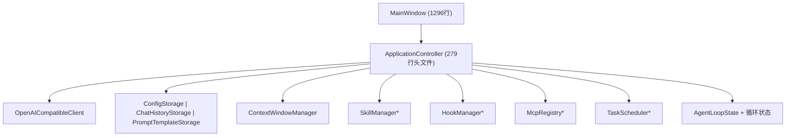
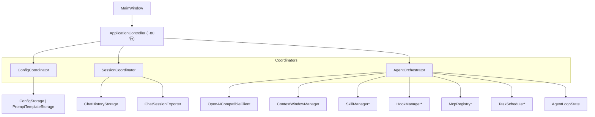
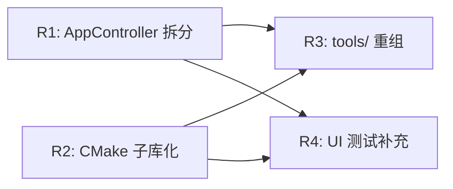
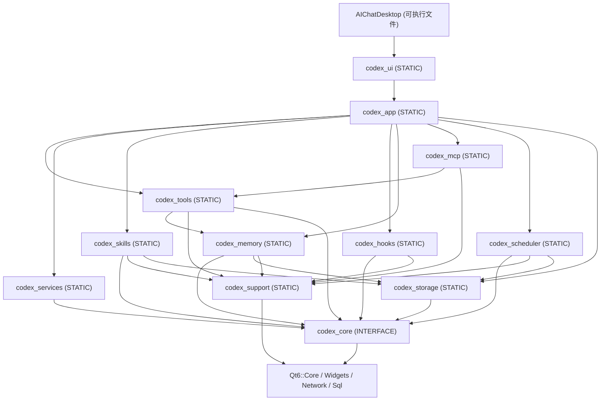
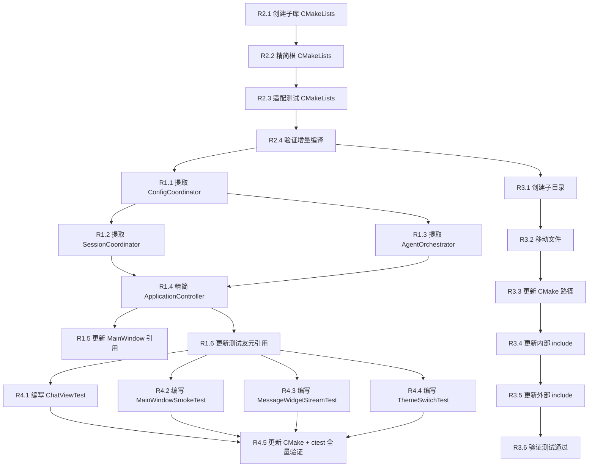

# CodeXX 重构方案 — 详细设计与任务分解

> 设计日期：2026-06-04 | 设计者：高见远（架构师）  
> 基于：项目全面分析报告（综合评分 8.1/10）  
> 约束：零外部行为变更，63/63 测试保持通过

---

## 一、系统设计总览

### 1.1 重构前后架构对比

**重构前（现状）：**



**重构后（目标）：**



ApplicationController 精简为纯信号路由层，每个协调器独立负责一个领域。

### 1.2 四项改进依赖关系



- **R1 和 R2 相互独立**，可并行实施
- **R2 推荐先做**（1-2 天小工作量），为 R3/R4 提供稳定的增量编译基础
- **R1 和 R2 完成后**，R3（目录重组）路径变更可直接通过 CMake 验证
- **R4（测试补充）**依赖 R1 拆分后的新类存在稳定接口

### 1.3 推荐实施顺序

| 阶段 | 改进项 | 工时 | 验证方式 |
|------|--------|------|----------|
| Step 1 | **R2: CMake 子库化** | 1-2 天 | `ctest` 全绿，增量编译正常 |
| Step 2 | **R1: AppController 拆分** | 3-5 天 | 拆分后 `ctest` 全绿，功能无回归 |
| Step 3 | **R3: tools/ 目录重组** | 0.5 天 | CMake 构建通过，include 路径兼容 |
| Step 4 | **R4: UI 测试补充** | 2-3 天 | 新增测试通过，总测试数 ≥ 66 |

---

## 二、R1: ApplicationController 职责拆分

### 2.1 拆分目标

| 类名 | 目标行数 | 职责 |
|------|---------|------|
| `SessionCoordinator` | ~150 | 会话 CRUD、分支、搜索、导出 |
| `ConfigCoordinator` | ~100 | 配置读写、提供者预设、模板管理 |
| `AgentOrchestrator` | ~250 | Agent 循环、工具执行、Hook/Skill/MCP 协调 |
| `ApplicationController` | ~80 | 顶层胶水代码 + 信号路由 |

### 2.2 新类接口设计

#### ConfigCoordinator

```cpp
// src/app/ConfigCoordinator.h
class ConfigCoordinator : public QObject {
    Q_OBJECT
public:
    explicit ConfigCoordinator(QObject *parent = nullptr);
    void initialize();

    const AppConfig &config() const;
    const QVector<PromptTemplate> &promptTemplates() const;

public slots:
    void saveConfig(const AppConfig &config);
    void savePromptTemplates(const QVector<PromptTemplate> &templates);

signals:
    void configChanged();
    void promptTemplatesChanged();
    void configurationMissing();
    void startupWarning(const QString &english, const QString &chinese);

private:
    AppConfig m_config;
    QVector<PromptTemplate> m_promptTemplates;
    ConfigStorage m_configStorage;
    PromptTemplateStorage m_promptTemplateStorage;
};
```

#### SessionCoordinator

```cpp
// src/app/SessionCoordinator.h
class SessionCoordinator : public QObject {
    Q_OBJECT
public:
    explicit SessionCoordinator(const QString &dbPath, QObject *parent = nullptr);
    void initialize();

    const ChatSession &currentSession() const;
    const QVector<ChatSession> &sessionSummaries() const;
    SessionListFilter sessionListFilter() const;
    bool exportCurrentSessionMarkdown(const QString &filePath, QString *error = nullptr) const;
    bool historyAvailable() const;
    bool hasPersistableCurrentSession() const;

public slots:
    void startNewChat();
    void switchToSession(const QString &sessionId);
    void deleteCurrentSession();
    void renameCurrentSession(const QString &title);
    void searchSessions(const QString &query);
    void setSessionListFilter(SessionListFilter filter);
    void toggleCurrentSessionFavorite();
    void toggleCurrentSessionArchived();
    bool saveCurrentSession(bool moveToTop = true);
    bool editCurrentMessage(const QString &messageId, const QString &newContent);
    void truncateCurrentSessionFrom(const QString &messageId);
    void createMessageBranch(const QString &parentMessageId);
    void setSystemPrompt(const QString &prompt);

signals:
    void sessionListChanged();
    void sessionListFilterChanged();
    void currentSessionChanged();

private:
    ChatSession m_session;
    QVector<ChatSession> m_sessionSummaries;
    SessionListFilter m_sessionListFilter = SessionListFilter::Active;
    ChatHistoryStorage m_chatHistoryStorage;
    QString m_sessionSearchQuery;
    bool m_historyAvailable = false;

    bool reloadSessionSummaries(QString *error = nullptr);
    void upsertCurrentSessionSummary(bool moveToTop);
    bool sessionMatchesCurrentFilter(const ChatSession &session) const;
};
```

#### AgentOrchestrator

```cpp
// src/app/AgentOrchestrator.h
class AgentOrchestrator : public QObject {
    Q_OBJECT
public:
    explicit AgentOrchestrator(AppConfig &sharedConfig, QObject *parent = nullptr);
    void initialize();

    AIClient *aiClient() { return &m_aiClient; }
    bool isGenerating() const;
    bool agentDebugMode() const;
    bool hasPendingAgentState() const;
    AgentLoopState pendingAgentState() const;
    QJsonArray &pendingImages();

public slots:
    void sendMessage(const QString &content);
    void sendMessageWithImages(const QString &content, const QStringList &imageBase64List);
    void cancelCurrentRequest();
    void retryLastRequest();
    void sendUnifiedMessage(const QString &content);
    void sendAgentLoopMessage(const QString &content);
    void setAgentDebugMode(bool enabled);
    void resumeAgentLoop();
    void clearAgentLoopState();
    void addScheduledTask(const QString &name, const QString &cron, const QString &prompt);
    void removeScheduledTask(const QString &taskId);
    void updateScheduledTask(const ScheduledTask &task);
    QVector<ScheduledTask> scheduledTasks() const;

signals:
    void userMessageAdded(const QString &content);
    void assistantMessageStarted();
    void assistantMessageUpdated(const QString &content);
    void generatingChanged(bool generating);
    void agentLoopIterationUpdated(int iteration, int maxIterations);
    void agentLoopSkillSummary(const QString &summary);
    void agentLoopThought(int iteration, const QString &reasoning,
                          const QString &toolId, const QString &title);
    void agentLoopToolFinished(int iteration, const QString &toolId,
                               bool ok, const QString &outputPreview);
    void agentLoopPromptDebug(const QString &prompt);
    void retryAvailableChanged(bool available);
    void agentResumeAvailable(const QString &goal, int stepIndex);
    void tokenUsageUpdated(int used, int limit);
    void statusMessage(const QString &english, const QString &chinese, int timeoutMs);

private:
    // 所有当前 ApplicationController 的 Agent/流式/工具相关私有成员转移至此
    AppConfig &m_sharedConfig;                          // 引用 ConfigCoordinator 的配置
    OpenAICompatibleClient m_aiClient;
    ContextWindowManager m_contextWindowManager;
    SummaryAPIClient m_summaryClient;
    std::unique_ptr<SkillManager> m_skillManager;
    std::unique_ptr<HookManager> m_hookManager;
    std::unique_ptr<McpRegistry> m_mcpRegistry;
    std::unique_ptr<TaskScheduler> m_taskScheduler;
    AgentLoopState m_agentLoopState;
    // ... 所有 private 流式/循环状态
};
```

#### ApplicationController (精简后)

```cpp
// src/app/ApplicationController.h (~80行)
class ApplicationController : public QObject {
    Q_OBJECT
public:
    explicit ApplicationController(QObject *parent = nullptr);
    ~ApplicationController() override;
    void initialize();

    // 委托访问器
    ConfigCoordinator *configCoordinator() { return &m_configCoordinator; }
    SessionCoordinator *sessionCoordinator() { return &m_sessionCoordinator; }
    AgentOrchestrator *agentOrchestrator() { return &m_agentOrchestrator; }

    // 便捷委托（保持向后兼容）
    const AppConfig &config() const;
    const ChatSession &currentSession() const;
    // ... 仅保留 MainWindow 直接调用的委托方法

signals:
    // 转发信号（connect 到各协调器的信号）
    void configChanged();
    void sessionListChanged();
    void currentSessionChanged();
    void userMessageAdded(const QString &content);
    void assistantMessageStarted();
    void assistantMessageUpdated(const QString &content);
    void generatingChanged(bool generating);
    // ... 全部信号转发

private:
    ConfigCoordinator m_configCoordinator;
    SessionCoordinator m_sessionCoordinator;
    AgentOrchestrator m_agentOrchestrator;
};
```

### 2.3 R1 任务分解

| 任务ID | 任务 | 前置 | 涉及文件 | 验收标准 |
|--------|------|------|----------|----------|
| **R1.1** | 提取 ConfigCoordinator | 无 | 新建 ConfigCoordinator.h/.cpp | 编译通过，ConfigStorageTest 通过 |
| **R1.2** | 提取 SessionCoordinator | R1.1 | 新建 SessionCoordinator.h/.cpp | ChatHistoryStorageTest 通过，侧边栏功能正常 |
| **R1.3** | 提取 AgentOrchestrator | R1.1 | 新建 AgentOrchestrator.h/.cpp | Agent 相关测试通过，消息流式响应正常 |
| **R1.4** | 精简 ApplicationController | R1.2, R1.3 | 修改 ApplicationController.h/.cpp | 全量 63 测试通过，功能无回归 |
| **R1.5** | 更新 MainWindow 引用 | R1.4 | 修改 MainWindow.cpp（约 15 处调用更新） | 编译通过，手动功能测试 |
| **R1.6** | 更新测试友元引用 | R1.4 | 修改 ChatToolExecutionTest, AgentLoopExecutionTest | 所有测试通过 |

**R1.1 详细步骤（ConfigCoordinator 提取）：**

```
1. 创建 src/app/ConfigCoordinator.h
   - 从 ApplicationController.h 迁移 AppConfig, PromptTemplate, ConfigStorage, PromptTemplateStorage 成员及方法
   - 保留信号 configChanged, promptTemplatesChanged, configurationMissing, startupWarning

2. 创建 src/app/ConfigCoordinator.cpp
   - 迁移 saveConfig(), savePromptTemplates(), initialize() 中的配置加载逻辑
   - 迁移 text() 方法（语言选择逻辑）

3. 修改 ApplicationController.h
   - 移除已迁移的成员变量
   - 添加 ConfigCoordinator m_configCoordinator 成员
   - 添加委托方法 config(), promptTemplates(), saveConfig(), savePromptTemplates()

4. 修改 ApplicationController.cpp
   - 构造函数中创建 ConfigCoordinator
   - connect 信号转发
   - 其他方法通过 m_configCoordinator 委托

5. 更新 CMakeLists.txt（如果已完成 R2，则更新 src/app/CMakeLists.txt）
   - 添加 ConfigCoordinator.h/.cpp

6. 验证: cmake --build . -j4 && ctest
```

**R1.3 关键注意事项（AgentOrchestrator 提取）：**

AgentOrchestrator 是拆分中最复杂的部分，因为它持有流式处理状态和 Agent 循环状态。需要特别注意：
- `OpenAICompatibleClient` 的信号连接（textDeltaReceived, toolCallsReceived 等）需在 AgentOrchestrator 内部完成
- `handleTextDelta`, `handleToolCallsReceived`, `handleRequestFinished` 等 slot 全部迁移至 AgentOrchestrator
- `PendingToolResult`, `ActiveRequestKind` 等辅助类型一并迁移
- ConfigCoordinator 的配置变更需通知 AgentOrchestrator 更新 AI 客户端设置（通过信号 connect）

---

## 三、R2: CMake 子库化

### 3.1 库依赖图



### 3.2 每个子库的 CMakeLists.txt

#### src/core/CMakeLists.txt
```cmake
add_library(codex_core INTERFACE)
target_sources(codex_core INTERFACE
    AppConfig.h
    AppLanguage.h
    AgentLoopState.h
    ChatMessage.h
    ChatSession.h
    MessageRole.h
    PromptTemplate.h
    ProviderPreset.h
    ProviderPreset.cpp
    SessionListFilter.h
)
target_include_directories(codex_core INTERFACE ${PROJECT_SOURCE_DIR}/src)
target_link_libraries(codex_core INTERFACE Qt6::Core)
```

#### src/support/CMakeLists.txt
```cmake
add_library(codex_support STATIC
    AppLogger.h    AppLogger.cpp
    LogFileReader.h LogFileReader.cpp
)
target_include_directories(codex_support PUBLIC ${PROJECT_SOURCE_DIR}/src)
target_link_libraries(codex_support PUBLIC Qt6::Core)
```

#### src/storage/CMakeLists.txt
```cmake
add_library(codex_storage STATIC
    ConfigStorage.h    ConfigStorage.cpp
    ChatHistoryStorage.h ChatHistoryStorage.cpp
    ChatSessionExporter.h ChatSessionExporter.cpp
    PromptTemplateStorage.h PromptTemplateStorage.cpp
    CredentialStorage.h
)
if(WIN32)
    target_sources(codex_storage PRIVATE
        WindowsCredentialStorage.h WindowsCredentialStorage.cpp
    )
endif()
target_include_directories(codex_storage PUBLIC ${PROJECT_SOURCE_DIR}/src)
target_link_libraries(codex_storage PUBLIC codex_core Qt6::Core Qt6::Sql)
if(WIN32)
    target_link_libraries(codex_storage PUBLIC Advapi32)
endif()
```

#### src/services/CMakeLists.txt
```cmake
add_library(codex_services STATIC
    AIClient.h
    OpenAICompatibleClient.h OpenAICompatibleClient.cpp
    RequestErrorCategory.h
    StreamParser.h StreamParser.cpp
    ToolCall.h
)
target_include_directories(codex_services PUBLIC ${PROJECT_SOURCE_DIR}/src)
target_link_libraries(codex_services PUBLIC codex_core Qt6::Core Qt6::Network)
```

#### src/tools/CMakeLists.txt
```cmake
add_library(codex_tools STATIC
    AgentToolCatalog.h        AgentToolCatalog.cpp
    AgentToolRegistry.h       AgentToolRegistry.cpp
    CommandPolicy.h           CommandPolicy.cpp
    CommandRunner.h           CommandRunner.cpp
    FileInteractionService.h  FileInteractionService.cpp
    WorkspaceFileService.h    WorkspaceFileService.cpp
    WorkspacePolicy.h         WorkspacePolicy.cpp
    JsonCompactTool.h         JsonFormatTool.h
    JsonTools.cpp
    LocalTool.h               TextCleanupTool.h
    MarkdownCleanupTool.h     TextTools.cpp
    ToolResult.h
    GitReviewService.h        GitReviewService.cpp
    LogSummaryService.h       LogSummaryService.cpp
    CsvDataService.h          CsvDataService.cpp
    ProjectFindService.h      ProjectFindService.cpp
    WindowDetector.h          WindowDetector.cpp
    ScreenCaptureService.h    ScreenCaptureService.cpp
    OcrService.h              OcrService.cpp
    UiAutomationService.h     UiAutomationService.cpp
    InputSimulator.h          InputSimulator.cpp
    ForegroundValidator.h     ForegroundValidator.cpp
    SystemInfoService.h       SystemInfoService.cpp
    AssistantService.h        AssistantService.cpp
)
target_include_directories(codex_tools PUBLIC ${PROJECT_SOURCE_DIR}/src)
target_link_libraries(codex_tools PUBLIC
    codex_core codex_memory codex_support Qt6::Core
)
```

#### src/skills/CMakeLists.txt
```cmake
add_library(codex_skills STATIC
    SkillDefinition.h
    SkillFileParser.h  SkillFileParser.cpp
    SkillManager.h     SkillManager.cpp
)
target_include_directories(codex_skills PUBLIC ${PROJECT_SOURCE_DIR}/src)
target_link_libraries(codex_skills PUBLIC codex_core codex_support codex_storage Qt6::Core)
```

#### src/hooks/CMakeLists.txt
```cmake
add_library(codex_hooks STATIC
    HookDefinition.h
    HookManager.h     HookManager.cpp
    BuiltinHooks.h    BuiltinHooks.cpp
    ScriptHookRunner.h ScriptHookRunner.cpp
)
target_include_directories(codex_hooks PUBLIC ${PROJECT_SOURCE_DIR}/src)
target_link_libraries(codex_hooks PUBLIC codex_core codex_support Qt6::Core)
```

#### src/memory/CMakeLists.txt
```cmake
add_library(codex_memory STATIC
    MemoryEntry.h
    DailyMemoryWriter.h  DailyMemoryWriter.cpp
    ProjectMemoryManager.h ProjectMemoryManager.cpp
)
target_include_directories(codex_memory PUBLIC ${PROJECT_SOURCE_DIR}/src)
target_link_libraries(codex_memory PUBLIC codex_core codex_storage codex_support Qt6::Core)
```

#### src/mcp/CMakeLists.txt
```cmake
add_library(codex_mcp STATIC
    McpConnector.h McpConnector.cpp
    McpRegistry.h  McpRegistry.cpp
)
target_include_directories(codex_mcp PUBLIC ${PROJECT_SOURCE_DIR}/src)
target_link_libraries(codex_mcp PUBLIC codex_tools codex_support Qt6::Core Qt6::Network)
```

#### src/scheduler/CMakeLists.txt
```cmake
add_library(codex_scheduler STATIC
    ScheduledTask.h
    TaskScheduler.h TaskScheduler.cpp
    TaskStorage.h   TaskStorage.cpp
)
target_include_directories(codex_scheduler PUBLIC ${PROJECT_SOURCE_DIR}/src)
target_link_libraries(codex_scheduler PUBLIC codex_core codex_support codex_storage Qt6::Core)
```

#### src/app/CMakeLists.txt
```cmake
add_library(codex_app STATIC
    ApplicationController.h ApplicationController.cpp
    AgentLoopController.h   AgentLoopController.cpp
    AgentLoopActionParser.h AgentLoopActionParser.cpp
    AgentLoopPromptBuilder.h AgentLoopPromptBuilder.cpp
    AgentPlan.h             AgentPlan.cpp
    AgentPlanExecutor.h     AgentPlanExecutor.cpp
    AgentPlanParser.h       AgentPlanParser.cpp
    AgentPlanPromptBuilder.h AgentPlanPromptBuilder.cpp
    AgentToolCallPlanBuilder.h AgentToolCallPlanBuilder.cpp
    AgentCommandSkillCatalog.h AgentCommandSkillCatalog.cpp
    AgentCommandSkillFileService.h AgentCommandSkillFileService.cpp
    TokenEstimator.h        TokenEstimator.cpp
    SummaryAPIClient.h      SummaryAPIClient.cpp
    ContextWindowManager.h  ContextWindowManager.cpp
    ProjectInstructionService.h ProjectInstructionService.cpp
    SessionSummaryList.h    SessionSummaryList.cpp
    # R1 新增文件（拆分后）
    ConfigCoordinator.h     ConfigCoordinator.cpp
    SessionCoordinator.h    SessionCoordinator.cpp
    AgentOrchestrator.h     AgentOrchestrator.cpp
)
target_include_directories(codex_app PUBLIC ${PROJECT_SOURCE_DIR}/src)
target_link_libraries(codex_app PUBLIC
    codex_core codex_services codex_storage codex_tools
    codex_skills codex_hooks codex_memory codex_mcp codex_scheduler
    Qt6::Core Qt6::Network
)
```

#### src/ui/CMakeLists.txt
```cmake
add_library(codex_ui STATIC
    MainWindow.h       MainWindow.cpp
    ChatView.h         ChatView.cpp
    MessageWidget.h    MessageWidget.cpp
    CodeHighlighter.h  CodeHighlighter.cpp
    AgentStepWidget.h  AgentStepWidget.cpp
    TokenBar.h         TokenBar.cpp
    TypingIndicator.h  TypingIndicator.cpp
    SettingsDialog.h   SettingsDialog.cpp
    ToolsDialog.h      ToolsDialog.cpp
    FileToolsDialog.h  FileToolsDialog.cpp
    RolePromptDialog.h RolePromptDialog.cpp
    LogViewerDialog.h  LogViewerDialog.cpp
    ScheduledTaskDialog.h ScheduledTaskDialog.cpp
)
target_include_directories(codex_ui PUBLIC ${PROJECT_SOURCE_DIR}/src)
target_link_libraries(codex_ui PUBLIC codex_app Qt6::Core Qt6::Widgets)
```

#### 根 CMakeLists.txt（简化后）
```cmake
cmake_minimum_required(VERSION 3.22)
project(AIChatDesktop VERSION 0.3.0 LANGUAGES CXX)

set(CMAKE_CXX_STANDARD 17)
set(CMAKE_CXX_STANDARD_REQUIRED ON)
set(CMAKE_CXX_EXTENSIONS OFF)

find_package(Qt6 REQUIRED COMPONENTS Core Widgets Network Sql Test)
qt_standard_project_setup()

# 按依赖顺序添加子目录
add_subdirectory(src/core)
add_subdirectory(src/support)
add_subdirectory(src/storage)
add_subdirectory(src/services)
add_subdirectory(src/memory)
add_subdirectory(src/tools)
add_subdirectory(src/skills)
add_subdirectory(src/hooks)
add_subdirectory(src/mcp)
add_subdirectory(src/scheduler)
add_subdirectory(src/app)
add_subdirectory(src/ui)

# 主可执行文件
qt_add_executable(AIChatDesktop src/main.cpp)
qt_add_resources(AIChatDesktop "app_resources"
    PREFIX "/"
    BASE "${PROJECT_SOURCE_DIR}/resources"
    FILES "${PROJECT_SOURCE_DIR}/resources/styles/app.qss"
)
target_link_libraries(AIChatDesktop PRIVATE codex_ui)

if(MINGW)
    target_link_options(AIChatDesktop PRIVATE -mwindows)
    set_target_properties(AIChatDesktop PROPERTIES WIN32_EXECUTABLE FALSE)
else()
    set_target_properties(AIChatDesktop PROPERTIES WIN32_EXECUTABLE TRUE)
endif()

include(CTest)
if(BUILD_TESTING)
    add_subdirectory(tests)
endif()
```

### 3.3 测试系统适配方案

子库化后，`tests/CMakeLists.txt` 需要调整为链接库而非直接编译源文件：

**调整前（当前模式）：**
```cmake
add_executable(AgentToolRegistryTest
    AgentToolRegistryTest.cpp
    ${AGENT_TOOL_REGISTRY_SOURCES}
)
```

**调整后（链接库模式）：**
```cmake
add_executable(AgentToolRegistryTest
    AgentToolRegistryTest.cpp
)
target_link_libraries(AgentToolRegistryTest PRIVATE
    codex_tools codex_core Qt6::Core
)
```

为兼容过渡期，保留变量定义但在内部映射为库链接：

```cmake
# tests/CMakeLists.txt 顶部
# 兼容变量（过渡期保留，后续逐步移除）
set(AGENT_TOOL_REGISTRY_SOURCES "")  # 不再需要直接编译源文件
set(AGENT_TOOL_REGISTRY_LIBS codex_tools codex_core)

function(add_codex_test TEST_NAME)
    add_executable(${TEST_NAME} ${TEST_NAME}.cpp ${ARGN})
    target_include_directories(${TEST_NAME} PRIVATE ${PROJECT_SOURCE_DIR}/src)
    # 测试默认链接常用库
    target_link_libraries(${TEST_NAME} PRIVATE
        codex_core codex_support Qt6::Core
    )
    add_test(NAME ${TEST_NAME} COMMAND ${TEST_NAME})
endfunction()
```

### 3.4 R2 任务分解

| 任务ID | 任务 | 前置 | 验收标准 |
|--------|------|------|----------|
| **R2.1** | 创建各子目录 CMakeLists.txt | 无 | 每个 add_subdirectory 无报错 |
| **R2.2** | 精简根 CMakeLists.txt | R2.1 | cmake 配置成功 |
| **R2.3** | 适配 tests/CMakeLists.txt | R2.2 | 63/63 测试通过 |
| **R2.4** | 验证增量编译 | R2.3 | 修改单个 .cpp 只触发对应库重编译 |

### 3.5 风险点

| 风险 | 缓解措施 |
|------|----------|
| Win32 平台 Advapi32 链接丢失 | 每个需要 Advapi32 的库在对应 CMakeLists.txt 中添加 `if(WIN32)` 条件链接 |
| 头文件 include 路径断裂 | 每个库统一 `target_include_directories(... PUBLIC ${PROJECT_SOURCE_DIR}/src)` |
| 测试文件源依赖断裂 | 渐进式迁移——先定义 `add_codex_test()`, 逐个测试从源编译改为库链接 |
| MinGW -mwindows 标志丢失 | 仅主可执行文件需要，保留在根 CMakeLists.txt |

---

## 四、R3: tools/ 目录重组

### 4.1 目标目录结构

```
src/tools/
├── registry/
│   ├── AgentToolCatalog.h         (移到)
│   ├── AgentToolCatalog.cpp
│   ├── AgentToolRegistry.h        (移到)
│   ├── AgentToolRegistry.cpp
│   └── ToolResult.h               (移到)
│
├── core/
│   ├── CommandPolicy.h            (移到)
│   ├── CommandPolicy.cpp
│   ├── CommandRunner.h            (移到)
│   ├── CommandRunner.cpp
│   ├── WorkspacePolicy.h          (移到)
│   ├── WorkspacePolicy.cpp
│   ├── WorkspaceFileService.h     (移到)
│   ├── WorkspaceFileService.cpp
│   ├── FileInteractionService.h   (移到)
│   └── FileInteractionService.cpp
│
├── perception/
│   ├── ScreenCaptureService.h     (移到)
│   ├── ScreenCaptureService.cpp
│   ├── OcrService.h               (移到)
│   ├── OcrService.cpp
│   ├── WindowDetector.h           (移到)
│   └── WindowDetector.cpp
│
├── input/
│   ├── InputSimulator.h           (移到)
│   ├── InputSimulator.cpp
│   ├── UiAutomationService.h      (移到)
│   ├── UiAutomationService.cpp
│   ├── ForegroundValidator.h      (移到)
│   └── ForegroundValidator.cpp
│
├── dev/
│   ├── GitReviewService.h         (移到)
│   ├── GitReviewService.cpp
│   ├── LogSummaryService.h        (移到)
│   ├── LogSummaryService.cpp
│   ├── CsvDataService.h           (移到)
│   ├── CsvDataService.cpp
│   ├── ProjectFindService.h       (移到)
│   └── ProjectFindService.cpp
│
├── text/
│   ├── JsonCompactTool.h          (移到)
│   ├── JsonFormatTool.h           (移到)
│   ├── JsonTools.cpp              (移到)
│   ├── LocalTool.h                (移到)
│   ├── MarkdownCleanupTool.h      (移到)
│   ├── TextCleanupTool.h          (移到)
│   └── TextTools.cpp              (移到)
│
└── assistant/
    ├── SystemInfoService.h        (移到)
    ├── SystemInfoService.cpp
    ├── AssistantService.h         (移到)
    └── AssistantService.cpp
```

### 4.2 include 路径兼容策略

文件移动后，所有 `#include "tools/Foo.h"` 需更新为新的子目录路径。兼容方案：

**方案 A（推荐）：使用 CMake 的 include 路径多目录支持**

```cmake
# src/tools/CMakeLists.txt（子库化后）
target_include_directories(codex_tools PUBLIC
    ${PROJECT_SOURCE_DIR}/src
    ${CMAKE_CURRENT_SOURCE_DIR}/registry
    ${CMAKE_CURRENT_SOURCE_DIR}/core
    ${CMAKE_CURRENT_SOURCE_DIR}/perception
    ${CMAKE_CURRENT_SOURCE_DIR}/input
    ${CMAKE_CURRENT_SOURCE_DIR}/dev
    ${CMAKE_CURRENT_SOURCE_DIR}/text
    ${CMAKE_CURRENT_SOURCE_DIR}/assistant
)
```

这样 `#include "AgentToolRegistry.h"` 仍可工作（无需带子目录前缀）。但最佳做法是更新 include 为 `#include "tools/registry/AgentToolRegistry.h"`。

**方案 B（长期推荐）：逐步迁移为带子目录前缀的 include**

在 R3 任务中一步到位更新所有 include 引用。因为 CMake 子库化（R2）后，修改 tools/ 内的 include 不会触发大面积重编译。

### 4.3 R3 任务分解

| 任务ID | 任务 | 验收标准 |
|--------|------|----------|
| **R3.1** | 创建子目录结构 | 7 个子目录存在 |
| **R3.2** | 移动文件到子目录 | 46 个文件全部就位 |
| **R3.3** | 更新 CMakeLists.txt 中的路径 | cmake 配置成功 |
| **R3.4** | 更新 tools/ 内部 include | 工具模块内部编译通过 |
| **R3.5** | 更新外部 include 引用（app/ 等） | 全项目编译通过 |
| **R3.6** | 更新 tests/ 中 tools 相关 include | 63/63 测试通过 |

---

## 五、R4: UI 测试补充

### 5.1 新增测试清单

| 新增测试 | 文件名 | 测试内容 | 复杂度 |
|---------|--------|----------|--------|
| ChatViewTest | tests/ui/ChatViewTest.cpp | 消息增删、流式更新、搜索、截断 | 中 |
| MainWindowTest | tests/ui/MainWindowSmokeTest.cpp | 关键交互烟雾测试 | 中 |
| MessageWidgetStreamTest | tests/ui/MessageWidgetStreamTest.cpp | 流式更新边界、混合内容 | 低 |
| ThemeSwitchTest | tests/ui/ThemeSwitchTest.cpp | 深色/浅色主题切换验证 | 低 |

### 5.2 ChatViewTest 详细测试用例

```cpp
// tests/ui/ChatViewTest.cpp
#include "ui/ChatView.h"
#include "ui/MessageWidget.h"
#include <QApplication>
#include <cassert>

int main(int argc, char *argv[]) {
    QApplication app(argc, argv);  // 必须，ChatView 需要 QWidget 上下文

    // T1: 添加消息后 ChatView 包含对应 MessageWidget
    {
        ChatView chatView;
        chatView.addMessage("msg-1", "Hello", "user");
        auto *widget = chatView.findChild<MessageWidget *>();
        assert(widget != nullptr);
    }

    // T2: 流式更新最后一条助手消息
    {
        ChatView chatView;
        chatView.addMessage("msg-1", "Hello", "user");
        chatView.addMessage("msg-2", "", "assistant");
        chatView.updateLastAssistantMessage("Hi there");
        // 验证第二条消息内容变为 "Hi there"
    }

    // T3: 搜索功能 — 高亮匹配项
    {
        ChatView chatView;
        chatView.addMessage("msg-1", "Hello World", "user");
        chatView.addMessage("msg-2", "World of AI", "assistant");
        chatView.showSearchBar();
        chatView.performSearch("World");
        // 验证两个消息都高亮了（不验证具体颜色，验证 findChild 能找到高亮 label）
    }

    // T4: 搜索导航 — 上下切换匹配项
    {
        ChatView chatView;
        chatView.addMessage("msg-1", "World1 World2", "user");
        chatView.showSearchBar();
        chatView.performSearch("World");
        chatView.navigateMatch(1);  // 下一个匹配
        // 验证导航不崩溃
    }

    // T5: 消息截断 — 从指定 ID 移除后续消息
    {
        ChatView chatView;
        chatView.addMessage("msg-1", "First", "user");
        chatView.addMessage("msg-2", "Second", "assistant");
        chatView.addMessage("msg-3", "Third", "user");
        chatView.removeMessagesFrom("msg-2");
        // 验证只有 msg-1 保留
    }

    // T6: 空 ChatView 不崩溃
    {
        ChatView chatView;
        chatView.performSearch("nothing");
        chatView.scrollToBottom();
        chatView.hideSearchBar();
    }

    return 0;
}
```

### 5.3 MainWindowSmokeTest 详细测试用例

```cpp
// tests/ui/MainWindowSmokeTest.cpp
#include "ui/MainWindow.h"
#include <QApplication>
#include <cassert>

int main(int argc, char *argv[]) {
    QApplication app(argc, argv);

    MainWindow window;

    // T1: 窗口创建后非空
    assert(!window.windowTitle().isEmpty());

    // T2: 标题初始为模型名称
    QString title = window.windowTitle();
    assert(title.size() > 0);

    // T3: 侧边栏存在
    auto *sidebar = window.findChild<QWidget *>("sidebar");
    assert(sidebar != nullptr);

    // T4: 聊天区存在
    auto *chatView = window.findChild<QWidget *>("chatView");
    assert(chatView != nullptr);

    // T5: 输入框存在
    auto *input = window.findChild<QWidget *>("messageInput");
    assert(input != nullptr);

    // T6: 发送按钮存在
    auto *sendBtn = window.findChild<QPushButton *>("sendButton");
    assert(sendBtn != nullptr);

    // T7: 主题切换按钮存在
    auto *themeBtn = window.findChild<QPushButton *>("themeToggleButton");
    assert(themeBtn != nullptr);

    // T8: 窗口默认尺寸符合设计
    int w = window.width();
    int h = window.height();
    assert(w >= 860 && h >= 560);

    return 0;
}
```

### 5.4 ThemeSwitchTest 详细测试用例

```cpp
// tests/ui/ThemeSwitchTest.cpp
#include "ui/MainWindow.h"
#include <QApplication>
#include <cassert>

int main(int argc, char *argv[]) {
    QApplication app(argc, argv);
    MainWindow window;

    // T1: 初始暗色模式属性为 false（默认浅色）
    bool initialDark = qApp->property("darkMode").toBool();
    // 验证属性存在即可（默认值可能因配置变化）

    // T2: 切换为深色模式
    qApp->setProperty("darkMode", true);
    window.toggleDarkMode();  // 触发主题切换
    assert(qApp->property("darkMode").toBool() == true);

    // T3: 切换为浅色模式
    qApp->setProperty("darkMode", false);
    window.toggleDarkMode();
    assert(qApp->property("darkMode").toBool() == false);

    // T4: 切换后 QSS 样式表正确加载
    // 验证 app.qss 资源存在且被加载（检查 styleSheet 非空）
    assert(!window.styleSheet().isEmpty() || !qApp->styleSheet().isEmpty());

    return 0;
}
```

### 5.5 CMakeLists.txt 中的新增测试注册

```cmake
# tests/CMakeLists.txt 新增

# ChatView 测试
add_executable(ChatViewTest
    ChatViewTest.cpp
)
target_link_libraries(ChatViewTest PRIVATE codex_ui codex_app Qt6::Core Qt6::Widgets)
add_test(NAME ChatViewTest COMMAND ChatViewTest)

# MainWindow 烟雾测试
add_executable(MainWindowSmokeTest
    MainWindowSmokeTest.cpp
)
target_link_libraries(MainWindowSmokeTest PRIVATE codex_ui codex_app Qt6::Core Qt6::Widgets)
add_test(NAME MainWindowSmokeTest COMMAND MainWindowSmokeTest)

# MessageWidget 流式更新测试
add_executable(MessageWidgetStreamTest
    MessageWidgetStreamTest.cpp
)
target_link_libraries(MessageWidgetStreamTest PRIVATE codex_ui Qt6::Core Qt6::Widgets)
add_test(NAME MessageWidgetStreamTest COMMAND MessageWidgetStreamTest)

# 主题切换测试
add_executable(ThemeSwitchTest
    ThemeSwitchTest.cpp
)
target_link_libraries(ThemeSwitchTest PRIVATE codex_ui codex_app Qt6::Core Qt6::Widgets)
add_test(NAME ThemeSwitchTest COMMAND ThemeSwitchTest)
```

**预期测试总数**：63（现有）+ 4（新增）= **67 个测试目标**

---

## 六、综合任务列表

### 总览

| 阶段 | 改进项 | 任务数 | 工时 | 优先级 |
|------|--------|--------|------|--------|
| R2 | CMake 子库化 | 4 | 1-2 天 | P0 |
| R1 | AppController 拆分 | 6 | 3-5 天 | P0 |
| R3 | tools/ 目录重组 | 6 | 0.5 天 | P1 |
| R4 | UI 测试补充 | 5 | 2-3 天 | P1 |

### 完整任务依赖图



### 阶段验证节点

| 里程碑 | 验证标准 | 通过条件 |
|--------|----------|----------|
| M1: R2 完成 | `cmake --build . -j4 && ctest` | 63/63 通过 + 增量编译正常 |
| M2: R1 完成 | `cmake --build . -j4 && ctest` | 63/63 通过 + 功能手动回归无异常 |
| M3: R3 完成 | `cmake --build . -j4 && ctest` | 63/63 通过 |
| M4: R4 完成 | `cmake --build . -j4 && ctest` | 67/67 通过 |

---

## 七、风险汇总与回滚策略

### 7.1 全局风险

| 风险 | 影响 | 概率 | 缓解措施 |
|------|------|------|----------|
| include 路径断裂 | 大面积编译错误 | 中 | Git 分支隔离，每个步骤 ctest 验证 |
| Qt MOC 失效 | Q_OBJECT 类找不到 | 低 | 每个库独立 AUTOMOC，cmake 自动处理 |
| 信号转发遗漏 | 功能静默失效 | 中 | R1.4 完成后完整手工回归测试 |
| 测试编译失败 | 阻断验证 | 中 | tests/ 适配在 R2 中优先完成 |

### 7.2 回滚策略

每个阶段在独立的 Git 分支进行：

```bash
# R2: CMake 子库化
git checkout -b refactor/cmake-sub-libs
# ... 实施 ...
# 如果失败：git checkout main && git branch -D refactor/cmake-sub-libs

# R1: AppController 拆分
git checkout -b refactor/app-controller-split
# ... 实施 ...
# 如果失败：git checkout main && git branch -D refactor/app-controller-split

# R3: tools/ 重组
git checkout -b refactor/tools-reorg
# ... 实施 ...

# R4: UI 测试补充
git checkout -b test/ui-coverage
# ... 实施 ...
```

**增量验证铁律**：每完成一个任务立即运行 `ctest`，确认全绿后再继续。

---

## 八、附录

### A. 现有配置/环境约束（保持不变）

```cmake
# 以下所有设置保持不变
set(CMAKE_CXX_STANDARD 17)
set(CMAKE_CXX_STANDARD_REQUIRED ON)
set(CMAKE_CXX_EXTENSIONS OFF)
qt_standard_project_setup()

# MinGW 特殊处理保持不变
if(MINGW)
    target_link_options(AIChatDesktop PRIVATE -mwindows)
    set_target_properties(AIChatDesktop PROPERTIES WIN32_EXECUTABLE FALSE)
endif()

# Windows Advapi32 保持不变
if(WIN32)
    target_link_libraries(codex_storage PUBLIC Advapi32)
endif()
```

### B. 不需要修改的内容

- `resources/styles/app.qss` — 无需改动
- `resources/app.qrc` — 无需改动
- `src/main.cpp` — 无需改动（ApplicationController 公开接口不变）
- `src/core/` — 纯数据结构，无需改动
- `src/support/` — AppLogger 无需改动
- `tests/*` 中测试代码逻辑 — 仅适配 include 和 CMake
