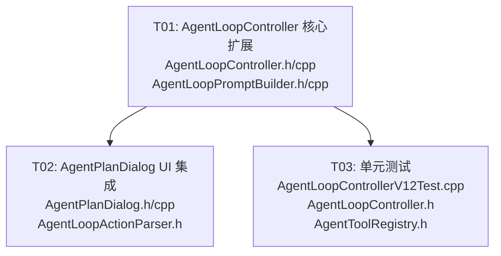

# V12.2 无限 Agentic Loop — 系统设计

## Part A: 系统设计

### 1. 实现方案

#### 1.1 核心挑战

`AIClient::sendChat()` 是异步的（通过信号 `textDeltaReceived` / `requestFinished` / `requestFailed` 返回结果），而 `executeLoop()` 的 while 循环需要"调 AI → 等待结果 → 继续"的同步语义。

#### 1.2 方案选型：QEventLoop 同步等待

**推荐方案**：使用 `QEventLoop` 做局部同步等待 + 信号 connect/disconnect。

**理由**：

| 方案 | 优点 | 缺点 |
|------|------|------|
| **QEventLoop（推荐）** | 与现有 `runPlan()` 同步风格一致；实现简洁 40 行内；调用方无需改动；Qt 官方认可模式 | 阻塞当前线程（但 Agent 执行本来就在独立调用栈） |
| 回调链 / 状态机 | 不阻塞线程 | 需要重构整个调用链；与同步 `runPlan()` 风格割裂；增加复杂度 |
| 协程 (QCoro) | 语法优雅 | 引入新依赖；团队学习成本；Qt 版本兼容性风险 |

**选择 QEventLoop 的关键论据**：
- `runPlan()` 已经是同步阻塞的（while 循环 + 工具执行），调用方（`AgentPlanDialog::executeRemainingSteps()`）在独立调用栈中运行，阻塞不影响 UI 响应
- Qt 官方文档明确推荐 QEventLoop 用于"将异步操作转为同步等待"
- 无需引入任何新依赖

#### 1.3 架构模式

保持现有的 **Namespace 函数 + 匿名命名空间辅助** 模式，与 `runPlan()` 一致：

```
AgentLoopController 命名空间
├── runPlan()                    ← 现有，不变
├── executeLoop()                ← 新增
├── runStatusToString()          ← 现有，不变
└── LoopTerminationPolicy        ← 新增结构体（在头文件中）
```

#### 1.4 maxSteps 升级

`AgentLoopOptions::maxSteps` 默认值从 **5 → 10**（路线图要求）。这会同时影响：
- `executeLoop()`：循环迭代上限
- `runPlan()`：行为不变（但默认上限从 5 变为 10）
- `AgentLoopPromptBuilder`：无需修改，它使用传入的 `maxSteps` 参数

#### 1.5 关键实现细节

**AiLoopRunner 内部类**（.cpp 匿名命名空间）：
- 封装单次 AI 调用：构建 ChatSession → 调 sendChat → QEventLoop 等待 → 收集 fullText
- 处理超时：QTimer::singleShot(maxStepMs) 退出 event loop
- 处理错误：requestFailed 信号 → 标记失败并退出 loop
- 信号清理：loop 退出后立即 disconnect 所有连接

**executeLoop() 主循环**：
```
初始化（timer, audit, observations）
while true:
  1. 检查终止条件（shouldStop, maxSteps, maxRuntime）
  2. buildNextActionPrompt(userGoal, observations, catalog, lang, completed, max)
  3. AiLoopRunner::call() → AiLoopResponse
  4. 如果 AI 调用失败 → 记录错误，返回 Failed
  5. parseJsonAction(response.fullText, catalog) → parseResult
  6. 如果解析失败 → 记录 observation，继续下一轮（或可选终止）
  7. 如果 action.done → 返回 Completed
  8. 执行 step.toolId 对应工具 → ToolResult
  9. 收集 observation → observations.append()
  10. executedStepCount++
```

### 2. 文件列表

```
src/app/AgentLoopController.h        ← 修改：新增 LoopTerminationPolicy, executeLoop()
src/app/AgentLoopController.cpp      ← 修改：新增 AiLoopRunner, executeLoop() 实现
src/app/AgentLoopPromptBuilder.h     ← 确认无修改（现有接口已满足）
src/app/AgentLoopPromptBuilder.cpp   ← 确认无修改（现有接口已满足）
src/app/AgentLoopActionParser.h      ← 确认无修改（parseJsonAction 已满足）
src/app/AgentLoopActionParser.cpp    ← 确认无修改
src/ui/AgentPlanDialog.h             ← 修改：新增循环模式 UI 成员
src/ui/AgentPlanDialog.cpp           ← 修改：新增循环模式按钮和逻辑
tests/app/AgentLoopControllerV12Test.cpp ← 新建：V12.2 单元测试
```

### 3. 数据结构和接口

```mermaid
classDiagram
    class LoopTerminationPolicy {
        +int maxSteps = 10
        +qint64 maxRuntimeMs = 60000
        +qint64 maxStepMs = 30000
        +function~bool()~ shouldStop
        +TerminationReason check(int completed, qint64 elapsed, qint64 stepMs) const
        +QString reasonLabel(TerminationReason) const
    }

    class TerminationReason {
        <<enum>>
        None
        StepLimit
        RuntimeLimit
        StepTimeout
        Stopped
        AIDone
        AIError
        ParseError
    }

    class AiLoopResponse {
        +bool ok
        +QString fullText
        +QString errorMessage
        +RequestErrorCategory errorCategory
        +static AiLoopResponse success(QString text)
        +static AiLoopResponse failure(QString msg, RequestErrorCategory cat)
    }

    class AgentLoopOptions {
        +int maxSteps = 10
        +qint64 maxRuntimeMs = 60000
        +qint64 maxStepMs = 30000
        +function~bool()~ shouldStop
    }

    class AgentLoopRunResult {
        +AgentLoopRunStatus status
        +int executedStepCount
        +QString error
        +QString lastToolId
        +QString lastOutput
        +QStringList auditTrail
    }

    class AgentLoopCallbacks {
        +function~void(int)~ stepStarted
        +function~void(int, ToolResult)~ stepFinished
    }

    LoopTerminationPolicy --> TerminationReason : uses
    AgentLoopOptions --> LoopTerminationPolicy : can construct from

    namespace AgentLoopController {
        AgentLoopRunResult executeLoop(
            AIClient* aiClient,
            const AppConfig& config,
            const QString& userGoal,
            const AgentToolRegistry& registry,
            const AgentToolExecutionContext& context,
            const AgentLoopOptions& options,
            const AgentLoopCallbacks& callbacks,
            AppLanguage language
        )
    }
```

### 4. 程序调用流程

```mermaid
sequenceDiagram
    participant UI as AgentPlanDialog
    participant Ctrl as AgentLoopController::executeLoop()
    participant Runner as AiLoopRunner (匿名空间)
    participant AIClient as AIClient (async)
    participant Loop as QEventLoop
    participant Builder as AgentLoopPromptBuilder
    participant Parser as AgentLoopActionParser
    participant Registry as AgentToolRegistry

    UI->>Ctrl: executeLoop(aiClient, config, goal, registry, context, options, callbacks, language)
    
    Note over Ctrl: 初始化 QElapsedTimer, audit trail, observations=[]

    loop while true
        Ctrl->>Ctrl: 检查 shouldStop / maxSteps / maxRuntime
        alt 终止条件触发
            Ctrl-->>UI: AgentLoopRunResult(StepLimitReached/Stopped/...)
        end

        Ctrl->>Builder: buildNextActionPrompt(goal, observations, catalog, lang, completed, max)
        Builder-->>Ctrl: prompt string

        Ctrl->>Runner: call(aiClient, config, prompt, maxStepMs)
        Runner->>AIClient: sendChat(config, session)
        Runner->>Loop: exec()
        Note over Loop: 阻塞等待...
        AIClient-->>Runner: textDeltaReceived(delta) × N
        AIClient-->>Runner: requestFinished()
        Loop-->>Runner: quit()
        Runner-->>Ctrl: AiLoopResponse{ok=true, fullText="..."}

        alt AI 调用失败
            Ctrl-->>UI: AgentLoopRunResult(Failed, error)
        end

        Ctrl->>Parser: parseJsonAction(fullText, catalog)
        Parser-->>Ctrl: AgentLoopActionParseResult

        alt 解析失败
            Ctrl->>Ctrl: observations << "[parse error]"
            Ctrl->>Ctrl: 继续下一轮
        end

        alt action.done == true
            Ctrl-->>UI: AgentLoopRunResult(Completed)
        end

        Ctrl->>Ctrl: callbacks.stepStarted(index)
        Ctrl->>Registry: execute(toolId, parameters, context)
        Registry-->>Ctrl: ToolResult
        Ctrl->>Ctrl: callbacks.stepFinished(index, toolResult)

        alt ToolResult 失败
            Ctrl-->>UI: AgentLoopRunResult(Failed, error)
        end

        Ctrl->>Ctrl: observations << toolResult.output
        Ctrl->>Ctrl: executedStepCount++
        Ctrl->>Ctrl: 检查 maxStepMs 超时
    end
```

### 5. 待明确事项

| # | 事项 | 假定 |
|---|------|------|
| 1 | 解析失败后是继续循环还是终止？ | **继续**：把解析错误作为 observation 反馈给 AI，让 AI 重试修正 |
| 2 | `AIClient` 是否线程安全？ | 假定在**主线程**调用，`QEventLoop::exec()` 在同一线程 |
| 3 | 无限循环模式是否需要用户确认每一步？ | 假定**不需要**：全自动执行（与 `runPlan()` 的 `executeRemainingSteps` 行为一致） |
| 4 | `AppConfig` 从哪里传入？ | 由 `AgentPlanDialog` 持有或从 `MainWindow` 传递 |
| 5 | AIClient 实例从哪里获取？ | `AgentPlanDialog` 通过构造函数参数接收，或从父窗口获取 |

---

## Part B: 任务分解

### 6. 所需依赖包

无新增第三方依赖。仅使用现有 Qt 模块：
- `Qt5Core`（QEventLoop, QElapsedTimer, QTimer, QJsonDocument）
- `Qt5Widgets`（AgentPlanDialog UI 控件）

### 7. 任务列表

#### T01: AgentLoopController 核心扩展

- **Task ID**: T01
- **Task Name**: AgentLoopController 核心扩展（LoopTerminationPolicy + AiLoopRunner + executeLoop）
- **Source Files**:
  - `src/app/AgentLoopController.h` — 修改：新增 `LoopTerminationPolicy` 结构体, `executeLoop()` 声明, `maxSteps` 升级
  - `src/app/AgentLoopController.cpp` — 修改：新增 `AiLoopRunner` 内部类, `executeLoop()` 完整实现
  - `src/app/AgentLoopPromptBuilder.h` — 确认阅读（接口无需修改）
  - `src/app/AgentLoopPromptBuilder.cpp` — 确认阅读（实现无需修改）
- **Dependencies**: 无
- **Priority**: P0

**实现要点**：
1. `AgentLoopOptions::maxSteps` 默认值从 5 → 10
2. 新增 `LoopTerminationPolicy` 结构体（头文件），包含 `TerminationReason` 枚举和 `check()` 方法
3. 新增 `AiLoopResponse` 结构体（头文件或 .cpp 匿名空间）
4. 新增 `AiLoopRunner` 内部类（.cpp 匿名命名空间），核心方法：`static AiLoopResponse call(AIClient*, const AppConfig&, const QString& prompt, qint64 maxStepMs)`
5. 新增 `executeLoop()` 函数实现，复用 `AgentLoopPromptBuilder::buildNextActionPrompt()` 和 `AgentLoopActionParser::parseJsonAction()`

#### T02: AgentPlanDialog UI 集成

- **Task ID**: T02
- **Task Name**: AgentPlanDialog 新增无限循环模式入口
- **Source Files**:
  - `src/ui/AgentPlanDialog.h` — 修改：新增 `m_loopButton`, `m_aiClient`, `executeInfiniteLoop()`, `requestStopLoop()` 成员
  - `src/ui/AgentPlanDialog.cpp` — 修改：新增按钮创建、信号连接、executeInfiniteLoop 实现
  - `src/app/AgentLoopActionParser.h` — 确认阅读（接口无需修改）
- **Dependencies**: T01
- **Priority**: P0

**实现要点**：
1. 新增"无限循环执行"按钮 (`m_loopButton`)，与现有"连续执行"按钮并列
2. 按钮触发 `executeInfiniteLoop()`，内部调用 `AgentLoopController::executeLoop()`
3. 复用现有 `m_stopButton` 停止机制（`m_stopRequested` 标记）
4. 需要获取 `AIClient*` 和 `AppConfig`（通过构造函数参数或从 MainWindow 传递）
5. 循环结束后在 `m_statusLabel` 显示结果摘要

#### T03: 单元测试

- **Task ID**: T03
- **Task Name**: V12.2 AgentLoopController 单元测试
- **Source Files**:
  - `tests/app/AgentLoopControllerV12Test.cpp` — 新建：完整测试文件
  - `src/app/AgentLoopController.h` — 阅读（测试依赖的接口）
  - `src/tools/AgentToolRegistry.h` — 阅读（测试依赖的接口）
- **Dependencies**: T01
- **Priority**: P1

**测试用例**：
1. **正常流程**：Mock AIClient 返回 done=true → 验证 Completed 状态
2. **多步执行**：Mock AI 依次返回 3 个 step，最后 done=true → 验证 executedStepCount=3
3. **步数限制**：maxSteps=2，AI 一直返回 step → 验证 StepLimitReached
4. **运行时限制**：maxRuntimeMs 触发 → 验证 RuntimeLimitReached
5. **用户停止**：shouldStop 返回 true → 验证 Stopped
6. **AI 返回 done=true**：第一步就 done → 验证 Completed + executedStepCount=0
7. **AI 调用失败**：Mock requestFailed → 验证 Failed
8. **工具执行失败**：AI 返回无效工具调用 → 验证工具失败处理
9. **解析失败恢复**：AI 返回非法 JSON → 验证 observation 注入 + 继续循环
10. **单步超时**：AI 响应超过 maxStepMs → 验证 StepTimeout

### 8. 共享知识

```
- 所有 AgentLoopController 函数保持同步阻塞风格，与 runPlan() 一致
- AIClient 调用必须在主线程进行（QEventLoop::exec() 在同一线程）
- AiLoopRunner::call() 内部创建 QEventLoop，必须在函数返回前 disconnect 所有信号连接，防止悬挂连接
- Prompt 格式与 AgentLoopPromptBuilder 保持一致：返回 JSON {done, message, step?}
- 审计日志格式沿用 Observe/Think/Act/Evaluate 四段式
- AgentLoopOptions::shouldStop 是 std::function，默认 nullptr 表示不检查
- LoopTerminationPolicy 从 AgentLoopOptions 构造，用于 while 循环内部的终止检查
- ToolResult 失败时 executeLoop() 返回 Failed（与 runPlan() 行为一致）
- observations 是 QStringList，每轮执行后追加 "{toolId}: {output}" 格式的观测
- maxSteps 默认值升级到 10 后，runPlan() 也受影响（接受范围扩大，但行为逻辑不变）
```

### 9. 任务依赖图



