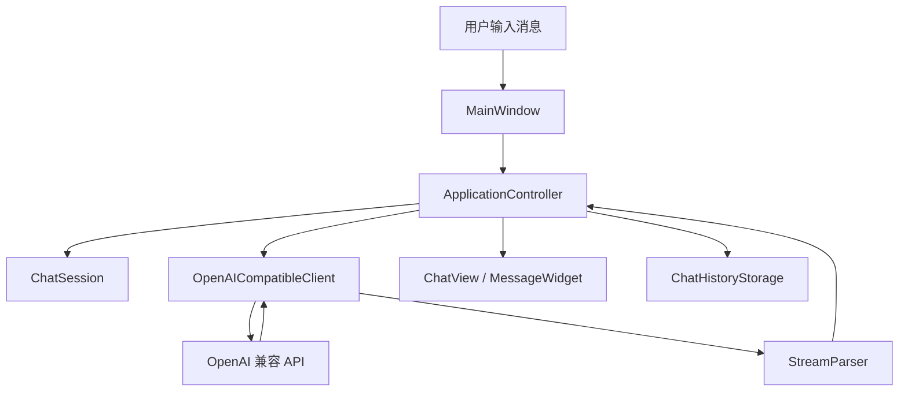

# 项目架构说明

AI Chat Desktop 是一个 Windows 桌面 AI 聊天应用，使用 C++17、Qt 6 Widgets、Qt Network、Qt SQL/SQLite 和 CMake 实现。项目采用分层结构，让界面、业务流程、服务调用和本地存储各自负责自己的事情。

## 1. 总体分层

```text
用户操作
  ↓
src/ui          Qt Widgets 界面层
  ↓
src/app         应用控制层
  ↓
src/services    AI API 和流式响应服务
src/storage     本地配置、凭据、聊天记录、模板存储
src/core        核心数据模型
src/support     日志、日志读取等通用能力
```

### `src/core`

核心模型层，保存业务数据结构，不直接依赖界面。

代表文件：

- `AppConfig.h`：Base URL、模型名、语言、模型参数等配置。
- `ChatSession.h`：一次会话，包含标题、角色提示词和消息列表。
- `ChatMessage.h`：单条消息。
- `MessageRole.h`：用户、AI、系统等消息角色。
- `PromptTemplate.h`：角色提示词模板。
- `ProviderPreset.h/.cpp`：DeepSeek、OpenAI、自定义服务商预设。

这一层的特点是稳定、轻量，适合作为自动化测试的基础。

### `src/ui`

界面层，负责窗口、按钮、输入框、对话气泡、设置窗口、日志窗口等。

代表文件：

- `MainWindow.h/.cpp`：主窗口，组织会话列表、聊天区域、输入区和顶部按钮。
- `SettingsDialog.h/.cpp`：设置窗口，配置服务商、API Key、模型和模型参数。
- `RolePromptDialog.h/.cpp`：角色提示词模板窗口。
- `MessageWidget.h/.cpp`：单条消息组件，支持复制和基础 Markdown 展示。
- `ChatView.h/.cpp`：聊天消息滚动区域。
- `LogViewerDialog.h/.cpp`：应用内日志查看窗口。

界面层不直接做网络请求或数据库细节，主要通过信号槽调用控制层。

### `src/app`

应用控制层，是界面和业务能力之间的协调者。

代表文件：

- `ApplicationController.h/.cpp`：处理初始化、发送消息、停止生成、重试、切换会话、保存配置等流程。
- `SessionSummaryList.h/.cpp`：维护会话列表排序规则。

控制层的作用是把多个模块串起来。例如发送消息时，它会：

1. 检查配置是否完整。
2. 把用户消息加入当前会话。
3. 通知界面追加用户消息。
4. 创建 AI 回复占位。
5. 调用 `OpenAICompatibleClient` 发起请求。
6. 接收流式返回并更新最后一条 AI 消息。
7. 保存聊天记录。

### `src/services`

服务层，负责和外部 AI API 通信。

代表文件：

- `AIClient.h`：AI 客户端接口。
- `OpenAICompatibleClient.h/.cpp`：OpenAI 兼容接口实现。
- `StreamParser.h/.cpp`：解析 Server-Sent Events 流式响应。
- `RequestErrorCategory.h`：请求错误分类。

这一层屏蔽了 HTTP 请求、流式解析和错误分类细节，控制层只关心“收到增量文本、请求完成、请求失败”这些事件。

### `src/storage`

存储层，负责本地持久化。

代表文件：

- `ConfigStorage.h/.cpp`：保存非敏感配置，例如 Base URL、模型名、语言、模型参数。
- `CredentialStorage.h`：凭据存储接口。
- `WindowsCredentialStorage.h/.cpp`：Windows Credential Manager 实现。
- `ChatHistoryStorage.h/.cpp`：SQLite 聊天记录存储。
- `PromptTemplateStorage.h/.cpp`：角色提示词模板 JSON 存储。
- `ChatSessionExporter.h/.cpp`：当前会话 Markdown 导出。

这里的关键设计是：API Key 不再写入普通配置，而是通过 Windows Credential Manager 保存。

### `src/support`

通用支持能力。

代表文件：

- `AppLogger.h/.cpp`：基础日志记录，并对 API Key、Bearer token 做脱敏。
- `LogFileReader.h/.cpp`：读取日志文件最近若干行，供日志窗口使用。

## 2. 依赖方向

理想依赖方向如下：

```text
ui  → app → services
ui  → app → storage
app → core
services → core
storage → core
support 被多层调用
```

这里的重点是：`ui` 不直接操作数据库和网络，`storage` 不依赖界面，`services` 不依赖界面。

这种结构带来的好处：

- 改界面时不容易影响网络请求。
- 改存储方案时不需要重写界面。
- 核心逻辑可以通过单元测试验证。
- 功能变多后，文件职责仍比较清楚。

## 3. 核心运行流程



## 4. 为什么需要 ApplicationController

如果所有逻辑都写在 `MainWindow` 里，后期会出现几个问题：

- 界面代码和业务代码混在一起，文件越来越长。
- 测试困难，因为逻辑依赖真实窗口。
- 网络请求、数据库保存、状态切换容易互相影响。
- 后续增加功能时容易产生重复代码。

抽出 `ApplicationController` 后，主窗口只负责展示和响应用户动作，控制层负责业务状态转换。这是桌面应用中常见的分层思路，类似轻量 MVVM/MVC。

## 5. 当前架构的取舍

当前项目没有引入复杂框架或依赖注入容器，这是有意的。

原因：

- 项目规模适中，Qt 自带信号槽已经能支撑模块通信。
- 过早引入复杂框架会增加学习成本。
- 目前用清晰目录、接口抽象和测试就能解决主要问题。

后续如果继续扩展，可以考虑：

- 为 `ApplicationController` 引入可替换的 AIClient，方便更细粒度测试。
- 增加 UI 自动化测试。
- 给会话搜索引入 SQLite FTS 全文索引。
- 把角色模板导入导出作为独立服务模块。
