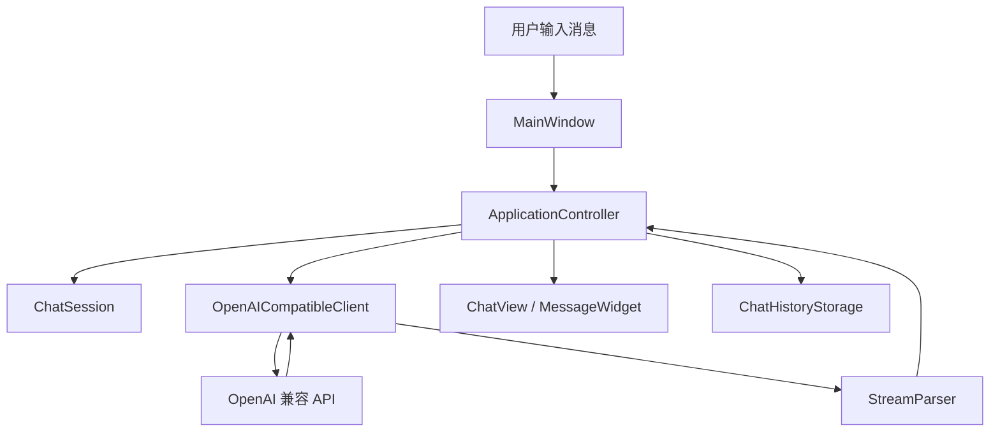

# 项目架构说明

AI Chat Desktop 是一个 Windows 桌面 AI 聊天应用，使用 C++17、Qt 6 Widgets、Qt Network、Qt SQL/SQLite 和 CMake 实现。项目采用分层结构，让界面、业务流程、服务调用和本地存储各自负责自己的事情。

## 1. 总体分层

```text
用户操作
  ↓
src/ui          Qt Widgets 界面层
  ↓
src/app         应用控制层
  ↓
src/services    AI API 和流式响应服务
src/storage     本地配置、凭据、聊天记录、模板存储
src/tools       本地文本工具
src/core        核心数据模型
src/support     日志、日志读取等通用能力
```

### `src/core`

核心模型层，保存业务数据结构，不直接依赖界面。

代表文件：

- `AppConfig.h`：Base URL、模型名、语言、模型参数等配置。
- `ChatSession.h`：一次会话，包含标题、角色提示词和消息列表。
- `ChatMessage.h`：单条消息。
- `MessageRole.h`：用户、AI、系统等消息角色。
- `PromptTemplate.h`：角色提示词模板。
- `ProviderPreset.h/.cpp`：DeepSeek、OpenAI、自定义服务商预设。
- `SessionListFilter.h`：会话列表筛选类型，用于全部、收藏和归档列表。

这一层的特点是稳定、轻量，适合作为自动化测试的基础。

### `src/ui`

界面层，负责窗口、按钮、输入框、对话气泡、设置窗口、日志窗口等。

代表文件：

- `MainWindow.h/.cpp`：主窗口，组织会话列表、聊天区域、输入区和顶部按钮。
- `SettingsDialog.h/.cpp`：设置窗口，配置服务商、API Key、模型和模型参数。
- `RolePromptDialog.h/.cpp`：角色提示词模板窗口。
- `MessageWidget.h/.cpp`：单条消息组件，支持复制和基础 Markdown 展示。
- `ChatView.h/.cpp`：聊天消息滚动区域。
- `LogViewerDialog.h/.cpp`：应用内日志查看窗口。
- `ToolsDialog.h/.cpp`：本地工具窗口，支持运行工具、复制输出和插入聊天输入框。
- `FileToolsDialog.h/.cpp`：文件工具窗口，支持读取用户选择的文本文件、列出文件夹、保存输出和打开确认后的路径。

界面层不直接做网络请求或数据库细节，主要通过信号槽调用控制层。

### `src/app`

应用控制层，是界面和业务能力之间的协调者。

代表文件：

- `ApplicationController.h/.cpp`：处理初始化、发送消息、停止生成、重试、切换会话、保存配置、收藏归档、筛选和 Agent 计划生成等流程。
- `SessionSummaryList.h/.cpp`：维护会话列表排序规则。
- `AgentCommandSkillCatalog.h/.cpp`：V9.1 开发者命令技能目录，把常见开发流程展开为 `command.*` 步骤模板。
- `AgentCommandSkillFileService.h/.cpp`：V10.2 外部技能文件读取服务，从项目目录读取 `skills/*.skill.md` 并校验工具 ID。
- `AgentToolCallPlanBuilder.h/.cpp`：V9.2 原生 Function Calling 转换器，把模型返回的 `tool_calls` 映射为本地 Agent 计划。
- `ProjectInstructionService.h/.cpp`：V10.1 项目级指令读取服务，从项目目录读取 `AGENT.md` 并生成安全包装后的 Prompt 片段。
- `AgentPlan.h/.cpp`：Agent 结构化计划和步骤状态。
- `AgentPlanParser.h/.cpp`：解析并校验 AI 返回的 JSON 计划。
- `AgentPlanPromptBuilder.h/.cpp`：把用户目标和工具目录整理为计划生成提示词。
- `AgentPlanExecutor.h/.cpp`：通过工具注册表执行用户确认后的工具步骤。
- `AgentLoopController.h/.cpp`：Agentic Loop 运行层，按观察、动作、评估循环执行工具。
- `AgentLoopActionParser.h/.cpp`：解析单轮 Agent action JSON，支持 `done=true` 终止信号。
- `AgentLoopPromptBuilder.h/.cpp`：生成单轮 Agent action 规划提示词。

控制层的作用是把多个模块串起来。例如发送消息时，它会：

1. 检查配置是否完整。
2. 把用户消息加入当前会话。
3. 通知界面追加用户消息。
4. 创建 AI 回复占位。
5. 调用 `OpenAICompatibleClient` 发起请求。
6. 接收流式返回并更新最后一条 AI 消息。
7. 保存聊天记录。

### `src/services`

服务层，负责和外部 AI API 通信。

代表文件：

- `AIClient.h`：AI 客户端接口。
- `OpenAICompatibleClient.h/.cpp`：OpenAI 兼容接口实现。
- `StreamParser.h/.cpp`：解析 Server-Sent Events 流式响应。
- `ToolCall.h`：原生 Function Calling 工具调用数据结构。
- `RequestErrorCategory.h`：请求错误分类。

这一层屏蔽了 HTTP 请求、流式解析和错误分类细节，控制层只关心“收到增量文本、收到工具调用、请求完成、请求失败”这些事件。

### `src/storage`

存储层，负责本地持久化。

代表文件：

- `ConfigStorage.h/.cpp`：保存非敏感配置，例如 Base URL、模型名、语言、模型参数。
- `CredentialStorage.h`：凭据存储接口。
- `WindowsCredentialStorage.h/.cpp`：Windows Credential Manager 实现。
- `ChatHistoryStorage.h/.cpp`：SQLite 聊天记录存储。
- `PromptTemplateStorage.h/.cpp`：角色提示词模板 JSON 存储。
- `ChatSessionExporter.h/.cpp`：当前会话 Markdown 导出。

这里的关键设计是：API Key 不再写入普通配置，而是通过 Windows Credential Manager 保存。

### `src/tools`

本地工具层，负责不调用 AI 的文本处理能力，以及 V6 的受控本地文件交互能力。

代表文件：

- `LocalTool.h`：本地工具统一接口。
- `ToolResult.h`：工具执行结果。
- `JsonFormatTool.h` / `JsonCompactTool.h`：JSON 格式化和压缩。
- `MarkdownCleanupTool.h` / `TextCleanupTool.h`：Markdown 和普通文本清理。
- `FileInteractionService.h/.cpp`：受控文件交互服务，提供文本读取、目录列出、文本保存、路径打开前校验和日志路径摘要。
- `WorkspacePolicy.h/.cpp`：Agent 工作目录策略，判断路径是否在工作目录内、是否属于受保护文件、是否允许自动操作。
- `WorkspaceFileService.h/.cpp`：Agent 工作目录文件服务，支持工作目录内创建、读取、列目录、覆盖和移动删除普通文件。
- `CommandPolicy.h/.cpp`：V9 命令策略，定义白名单命令模板、工作目录安全判断和风险等级。
- `CommandRunner.h/.cpp`：V9 命令运行器，使用 `QProcess` 执行程序和参数数组，并处理超时、输出截断和脱敏。
- `ProjectMemoryService.h/.cpp`：V10.3 受控工作记忆服务，读取 `AGENT_MEMORY.md` 并在用户确认后追加记忆。
- `AgentToolCatalog.h/.cpp`：Agent 可见工具目录，定义工具 ID、风险等级、输入限制和敏感结果标记。
- `AgentToolRegistry.h/.cpp`：工具注册表，统一工具描述、参数 schema、执行函数和 Function Calling 函数名。
- `GitReviewService.h/.cpp`：V11 Git 审查工具，提供 `git diff` 摘要和 `git log` 提交记录（只读）。
- `LogSummaryService.h/.cpp`：V11 日志摘要工具，按关键词/级别搜索应用日志并脱敏。
- `CsvDataService.h/.cpp`：V11 CSV 读写工具，轻量逗号/引号解析，限定工作目录。
- `ProjectFindService.h/.cpp`：V11 项目文件搜索工具，glob 模式匹配，排除构建产物和 VCS 目录。
- `AssistantService.h/.cpp`：V14 个人管家工具，工作日报、项目检查和文件整理（MVP）。

这一层不依赖主窗口，不直接访问剪贴板，也不直接发送消息。工具窗口只负责调用工具并展示结果。

V6 文件工具的关键边界是：路径由用户通过选择框提供，工具输出只展示或插入聊天输入框，不自动发送给 AI，不执行脚本或系统命令。

V7 Agent 的关键边界是：AI 只能生成计划和建议工具；本地解析器校验计划；用户确认后才执行低风险文本工具；文件工具仍需要走专用文件选择流程。

V8.1 Agent 的关键边界是：AI 可以建议 `workspace.*` 文件工具，但本地执行器必须先经过 `WorkspacePolicy` 校验；所有自动文件操作只能发生在 Agent 工作目录内；受保护文件不能自动创建、覆盖或删除；读取到的文件内容会被标记为不可信数据。

V8.2/V8.3 Agent 的关键边界是：连续执行由 `AgentLoopController` 统一管理，每轮只执行一个步骤，达到步数上限、失败、停止或重复动作时暂停；工具目录、参数 schema 和执行函数来自同一份 `AgentToolRegistry`，Function Calling schema 也从注册表生成。

V9 命令执行的关键边界是：AI 只能建议 `command.*` 白名单工具，不能拼接任意 PowerShell/CMD；`CommandPolicy` 负责把工具 ID 映射到固定程序和参数数组，`CommandRunner` 使用 `QProcess` 执行并设置超时，命令输出会截断和脱敏。当前开放的是 Git 状态、diff 检查、构建、测试和项目文件列表这类开发者命令。V9.1 进一步加入项目目录配置和开发者命令技能目录，例如提交前检查会展开为 diff check、build、ctest 三步。

V9.2 Function Calling 的关键边界是：请求体可以声明 `tools`，模型可以返回原生 `tool_calls`，但工具调用仍必须映射回 `AgentToolRegistry` 中已注册的函数名，参数必须解析为 JSON object，最终仍进入计划预览和用户确认流程。不支持 tools 或没有返回 tool_calls 时，旧 JSON plan fallback 继续可用。

V10.1 项目级指令的关键边界是：应用会读取 Agent 项目目录根部的 `AGENT.md`，但这份文件只作为项目上下文，不是系统指令。Prompt 中会明确说明它不能覆盖工具权限、安全规则、工作目录限制或用户确认要求。文件读取有 16 KB 默认上限，缺失时不影响 Agent 请求。

V10.2 外部技能的关键边界是：应用会读取 Agent 项目目录下的 `skills/*.skill.md`，但技能文件只描述推荐步骤，不会直接执行工具。每个步骤的工具 ID 必须存在于 `AgentToolRegistry` 且允许计划窗口直接执行；重复技能 ID 不覆盖内置技能；最终执行仍要经过计划预览、用户确认和本地工具策略。

V10.3 工作记忆的关键边界是：应用会读取 Agent 项目目录下的 `AGENT_MEMORY.md`，并允许通过 `memory.append_project_note` 追加用户确认后的记忆。它不会自动保存聊天全文，也不会保存模型输出；明显包含 API Key、password、token、Bearer、secret 等敏感字段的内容会被拒绝。记忆只作为受限项目上下文，不能扩大工具权限。

V11 统一模式的关键边界是：用户可通过统一入口发送消息，AI 自行判断返回聊天回复或任务计划。Native Function Calling 优先，失败后降级为 JSON Plan，再失败则当作普通聊天展示。取消生成会正确清理状态并显示"已停止"。

V11 工具生态的关键边界是：Git 工具只执行只读命令（diff/log/status），禁止 add/commit/push。日志工具脱敏 API Key/Token。CSV 工具限定工作目录内，行数上限。文件搜索工具排除 `.git`/`build-*` 等目录。所有新工具均在 `AgentToolRegistry` 中注册并经过计划窗口用户确认。

### `src/support`

通用支持能力。

代表文件：

- `AppLogger.h/.cpp`：基础日志记录，并对 API Key、Bearer token 做脱敏。
- `LogFileReader.h/.cpp`：读取日志文件最近若干行，供日志窗口使用。

## 2. 依赖方向

理想依赖方向如下：

```text
ui  → app → services
ui  → app → storage
ui  → tools
app → core
services → core
storage → core
tools → core
support 被多层调用
```

这里的重点是：`ui` 不直接操作数据库和网络，`storage` 不依赖界面，`services` 不依赖界面，`tools` 不依赖主窗口。

这种结构带来的好处：

- 改界面时不容易影响网络请求。
- 改存储方案时不需要重写界面。
- 核心逻辑可以通过单元测试验证。
- 功能变多后，文件职责仍比较清楚。

## 3. 核心运行流程



## 4. 为什么需要 ApplicationController

如果所有逻辑都写在 `MainWindow` 里，后期会出现几个问题：

- 界面代码和业务代码混在一起，文件越来越长。
- 测试困难，因为逻辑依赖真实窗口。
- 网络请求、数据库保存、状态切换容易互相影响。
- 后续增加功能时容易产生重复代码。

抽出 `ApplicationController` 后，主窗口只负责展示和响应用户动作，控制层负责业务状态转换。这是桌面应用中常见的分层思路，类似轻量 MVVM/MVC。

## 5. 当前架构的取舍

当前项目没有引入复杂框架或依赖注入容器，这是有意的。

原因：

- 项目规模适中，Qt 自带信号槽已经能支撑模块通信。
- 过早引入复杂框架会增加学习成本。
- 目前用清晰目录、接口抽象和测试就能解决主要问题。

后续如果继续扩展，可以考虑：

- 为 `ApplicationController` 引入可替换的 AIClient，方便更细粒度测试。
- 增加 UI 自动化测试。
- 给会话搜索引入 SQLite FTS 全文索引。
- 把角色模板导入导出作为独立服务模块。
- 在 V6 文件工具基础上进入 V7 AI 任务拆解和受控工具建议。
- 在 V9 命令执行基础上进入开发者技能、项目级指令和工作记忆。
- 在 V12/V13 之后再评估操作记录和设备输入模拟。
