# 关键业务流程

本文从“用户做了什么，代码怎样响应”的角度介绍项目流程。建议对照 `src/ui/MainWindow.cpp`、`src/app/ApplicationController.cpp` 和 `src/services/OpenAICompatibleClient.cpp` 阅读。

## 1. 应用启动流程

入口在 `src/main.cpp`。

主要步骤：

1. 创建 `QApplication`。
2. 设置应用名称和组织名称。
3. 设置浅色主题和 QSS 样式。
4. 初始化 `AppLogger`。
5. 创建并显示 `MainWindow`。
6. 进入 Qt 事件循环。

`MainWindow` 构造时会：

1. 创建界面控件。
2. 连接信号槽。
3. 调用 `ApplicationController::initialize()`。
4. 加载配置、角色模板和最近会话。

## 2. 配置加载和 API Key 迁移

相关模块：

- `ConfigStorage`
- `CredentialStorage`
- `WindowsCredentialStorage`

加载配置时：

1. `ConfigStorage` 从 `QSettings` 读取非敏感配置。
2. 从 Windows Credential Manager 读取 API Key。
3. 如果 Credential Manager 没有 API Key，但旧 `QSettings` 里还有 `api/apiKey`：
   - 尝试写入 Windows Credential Manager。
   - 写入成功后删除旧 `api/apiKey`。
4. 返回运行时 `AppConfig`。

这个流程解决的是“历史版本可能已经把 API Key 写进普通配置”的兼容问题。

保存配置时：

1. Base URL、模型名、语言、模型参数继续保存到 `QSettings`。
2. API Key 单独保存到 Windows Credential Manager。
3. 如果 API Key 为空，则删除系统凭据中的旧值。

## 3. 发送消息流程

入口通常是 `MainWindow::sendCurrentMessage()`。

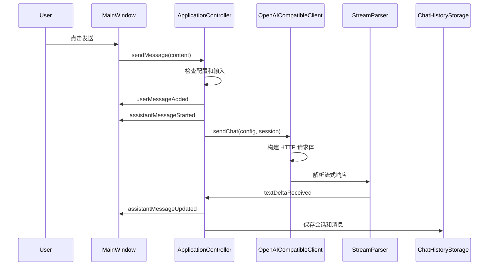

关键点：

- 用户消息会先加入当前会话。
- AI 回复会先创建一个空占位消息。
- 流式返回时不断更新最后一条 AI 消息。
- 请求完成后保存完整会话。

## 4. 流式响应解析

OpenAI 兼容接口通常返回 Server-Sent Events，格式类似：

```text
data: {"choices":[{"delta":{"content":"你好"}}]}

data: [DONE]
```

`StreamParser` 的职责是：

- 接收网络层分批到达的字节。
- 按 SSE 事件切分。
- 从 JSON 中取出增量文本。
- 识别 `[DONE]` 结束标记。

为什么需要单独解析器：

- 网络数据可能半包到达，一次 `readyRead` 不一定是一条完整消息。
- 解析逻辑可以独立测试。
- 服务层代码不会被字符串处理细节污染。

## 5. 停止生成流程

用户在生成中点击“停止”时：

1. `MainWindow::sendCurrentMessage()` 发现当前正在生成。
2. 调用 `ApplicationController::cancelCurrentRequest()`。
3. 控制层调用 `OpenAICompatibleClient::cancel()`。
4. 网络层 abort 当前 `QNetworkReply`。
5. 控制层把空 AI 回复更新为“已停止”。
6. 保存当前会话。

这个流程避免了用户必须等待长回复完成。

## 6. 失败重试流程

请求失败后：

1. `OpenAICompatibleClient` 根据 HTTP 状态码或网络错误生成错误分类。
2. `ApplicationController::handleRequestFailed()` 生成中英文友好提示。
3. 聊天区显示失败信息。
4. 控制层记录上一条用户消息。
5. 界面显示“重试”按钮。

点击重试时：

1. 控制层删除上一条失败的 AI 回复。
2. 重新创建 AI 回复占位。
3. 使用上一条用户消息重新发起请求。
4. 保存时使用 `replaceSessionMessages()`，避免数据库里残留旧失败回复。

## 7. 会话列表和排序

V3 修复过一个重要问题：点击会话导致列表顺序变乱。

设计原则：

- 只切换会话时，不应该改变排序。
- 会话内容真正更新时，才应该置顶。

相关模块：

- `SessionSummaryList`
- `ApplicationController::switchToSession()`
- `ApplicationController::saveCurrentSession(bool moveToTop)`

这类问题在真实产品中很常见，因为“读取”和“更新”如果没有区分清楚，就会产生用户觉得不稳定的行为。

## 8. 会话搜索流程

用户在左侧搜索框输入文本：

1. `MainWindow` 把文本传给 `ApplicationController::searchSessions()`。
2. 控制层调用 `ChatHistoryStorage::searchSessionSummaries()`。
3. SQLite 查询标题和消息内容。
4. 返回匹配的会话摘要。
5. 界面刷新会话列表。

当前使用 `LIKE` 查询，适合个人项目和中小数据量。大量历史记录时，可以考虑 SQLite FTS 全文索引。

## 9. Markdown 导出流程

用户点击导出：

1. 主窗口选择文件路径。
2. 控制层调用 `ChatSessionExporter::writeMarkdown()`。
3. 导出角色、时间和消息内容。
4. 时间使用 UTC+8 北京时间。
5. 文件不包含 API Key。

这是一个典型的“把业务数据转换成用户可读文件”的功能。

## 10. 日志查看流程

应用运行时通过 `AppLogger` 写日志。

日志窗口打开时：

1. `MainWindow` 创建 `LogViewerDialog`。
2. 对话框通过 `LogFileReader::readLastLines()` 读取最近 500 行。
3. 用户可以点击刷新。
4. 用户可以打开日志所在目录。

日志不记录：

- API Key。
- Bearer token。
- 请求体。
- 聊天正文。

这一点很重要，因为日志常用于排错，但不能泄露敏感信息。

## 11. 关闭窗口流程

曾经出现过“关闭窗口后 exe 仍被占用”的问题。

修复后的流程：

1. `MainWindow::closeEvent()` 检查是否正在生成。
2. 如果正在生成，先取消当前请求。
3. 接受关闭事件。
4. 调用 `QCoreApplication::quit()` 退出事件循环。

这个问题体现了桌面应用常见的资源释放意识：窗口消失不等于进程已经退出，网络请求、事件循环、后台对象都可能导致进程仍然存在。

## 12. Agent 工作目录文件流程

V8.1 开始，Agent 可以在默认工作目录内执行受控文件操作。

相关模块：

- `AgentPlanPromptBuilder`
- `AgentPlanParser`
- `AgentToolCatalog`
- `AgentPlanDialog`
- `AgentPlanExecutor`
- `WorkspacePolicy`
- `WorkspaceFileService`

流程如下：

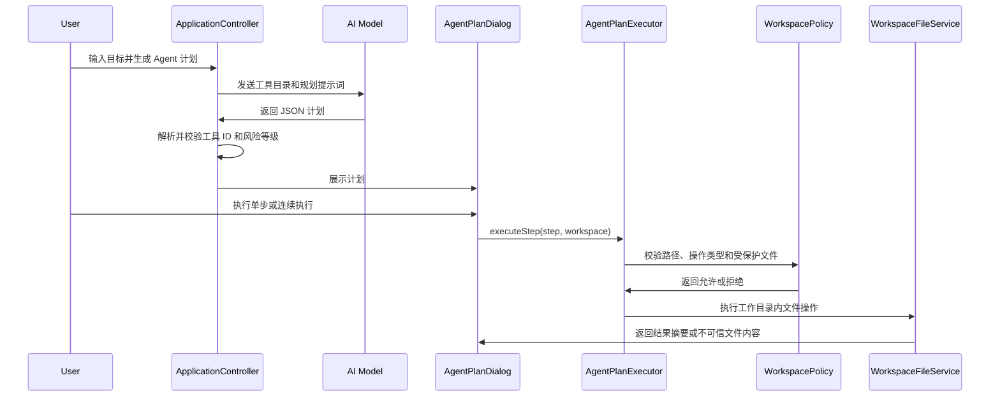

关键点：

- AI 不能直接操作文件系统，只能返回结构化计划。
- 工具 ID 必须存在于本地 `AgentToolCatalog`。
- `workspace.write_text` 创建新文件，不覆盖已有文件。
- `workspace.overwrite_text` 覆盖前生成 `.bak` 备份。
- `workspace.delete_file` 把文件移动到 `.trash`，不是永久删除。
- `workspace.read_text` 会把文件内容包裹为不可信数据。
- 连续执行最多 5 步，任一步失败会暂停。

这个流程体现了 Agent 开发中的核心原则：模型负责建议，本地代码负责权限、路径和实际执行。

## 13. Agentic Loop 连续执行流程（V19 D-2 异步化）

V8.2 开始计划窗口使用 `AgentLoopController`，V19 D-2 重构为异步引擎 `AgentLoopEngine`。

相关模块：

- `AgentLoopEngine`（`src/app/AgentLoopController.h`）
- `AgentOrchestrator`（`src/app/AgentOrchestrator.cpp`）

关键变化：D-2 前使用 `QEventLoop` 同步阻塞，D-2 后改用 `QTimer::singleShot(0)` 驱动异步迭代，每轮释放事件栈，UI 不再冻结。

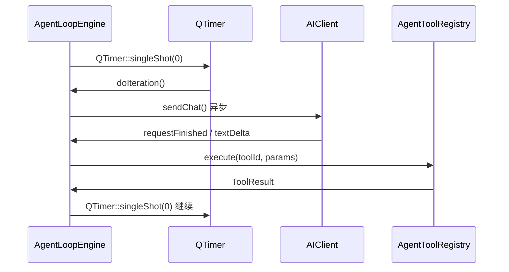

`executeLoop()` 同步包装仍保留给测试使用。

## 14. Python Sidecar 调用流程（V19）

Python sidecar 是一个通过 `QProcess` 运行的独立 Python 进程，通过 JSONL 协议与 C++ 通信。

相关模块：

- `PythonSidecarClient`（`src/services/PythonSidecarClient.h`）
- `PythonSidecarAIClient`（`src/services/PythonSidecarAIClient.h`）
- `protocol.py` / `capabilities.py`

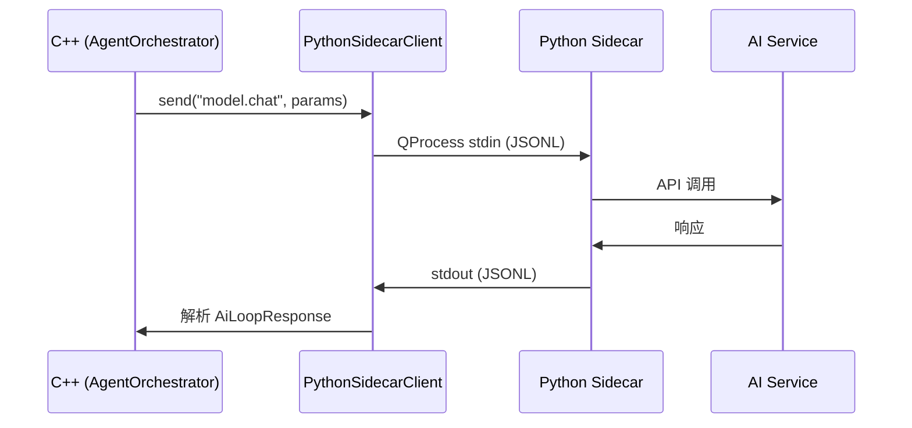

Sidecar 能力一行为独立方法注册在 `protocol.py` 中：`ping`、`token.count`、`model.chat`、`model.list_providers`、`web.extract`、`document.to_markdown`、N2 以 `browser.*` 前缀新增。

## 15. 浏览器自动化流程（N2）

通过 Python sidecar 的 Playwright 能力实现浏览器自动化。C++ 只负责工具注册和权限边界。

工具链路：

```
AgentToolRegistry → browser.open / browser.extract_text / browser.screenshot
    → Python sidecar browser.* method → Playwright headless → 结构化 observation
```

## 16. 插件系统流程（N4）

插件通过 QPluginLoader 动态加载，manifest 使用 plugin.json。

相关模块：

- `PluginInterface`（`src/plugins/PluginInterface.h`）
- `PluginManager`（`src/plugins/PluginManager.h/.cpp`）
- `AgentToolRegistry::registerPluginTools()`

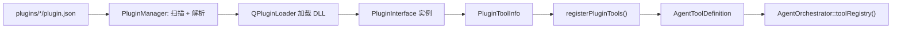

## 17. MCP 工具调用流程（V15-V19）

MCP 通过 `QProcess`（本地模式）或 `QSslSocket`（网络 TLS 模式）连接外部服务。V19 #23 新增网络模式。

相关模块：

- `McpRegistry` / `McpConnector`
- `AgentToolRegistry::registerExternalTools()`

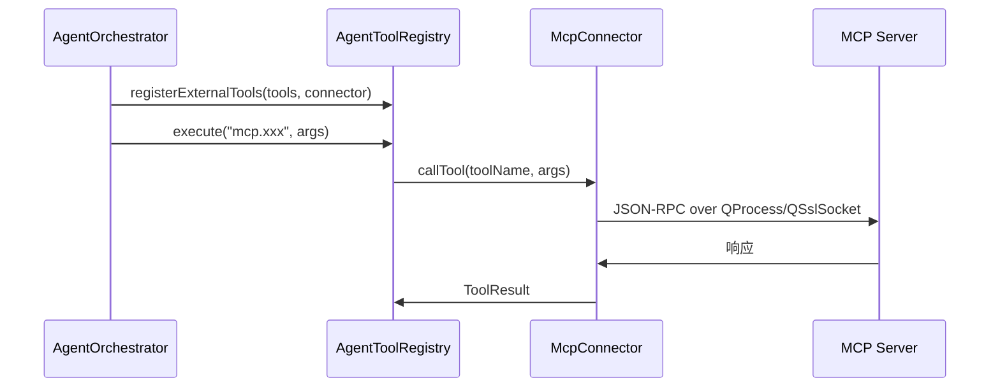

## 18. 自更新检查流程（N3）

用户点击设置页"检查更新"按钮，`UpdateChecker` 查询 GitHub Releases API。

相关模块：

- `UpdateChecker`（`src/services/UpdateChecker.h/.cpp`）
- SettingsDialog（`src/ui/SettingsDialog.cpp`）

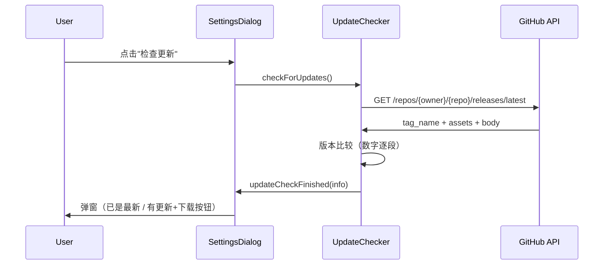

安全边界：不自动下载、不自动覆盖 exe、不自动执行。

## 19. 工具并行执行流程（#25）

V19 对只读工具组启用 `QtConcurrent` 并行执行。

相关模块：

- `AgentOrchestrator::executePlanAndReportToChat()`（`src/app/AgentOrchestrator.cpp`）
- `AgentPlanExecutor`
- `QtConcurrent::run()`

关键点：只读工具（文件读取、grep 等）可并发执行，写入操作仍然串行。

## 13. Agentic Loop 连续执行流程

V8.2 开始，计划窗口的连续执行不再自己维护循环，而是交给 `AgentLoopController`。

流程如下：

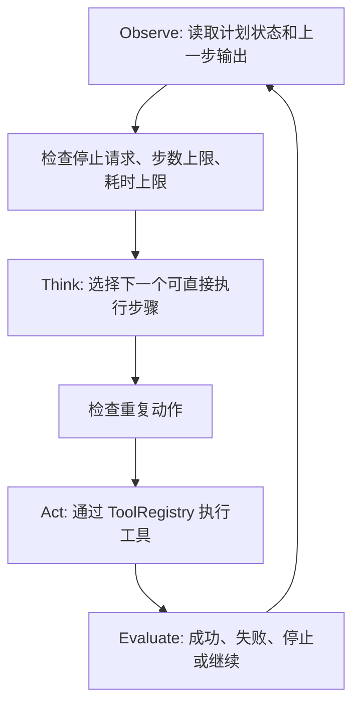

关键点：

- 每轮只执行一个工具步骤。
- 连续执行默认最多 5 步。
- 用户点击停止后，下一轮开始前会停止。
- 工具失败后不继续执行。
- 重复动作会被拦截。
- 日志记录 Observe、Think、Act、Evaluate 的摘要。

`AgentLoopPromptBuilder` 和 `AgentLoopActionParser` 预留给后续真实 AI 单步循环请求：模型每次只返回一个 action，或者返回 `done=true` 表示任务完成。

## 14. 工具注册表和 Function Calling 兼容流程

V8.3 开始，工具描述和执行函数统一放在 `AgentToolRegistry`。

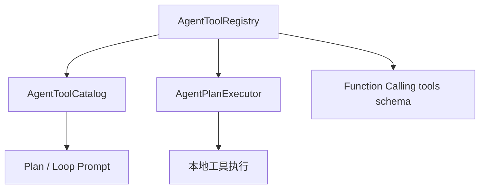

注册表中的每个工具包含：

- 工具 ID。
- 中英文描述。
- 风险等级。
- 参数 schema。
- Function Calling 函数名。
- 是否允许计划窗口直接执行。
- 执行函数。

这样做的好处：

- Prompt 和执行器不会维护两份工具定义。
- 新增工具时主要改注册表。
- Function Calling schema 可以从同一份定义生成。
- 不支持直接执行的文件选择工具不会进入 Function Calling schema。

## 15. 受控命令执行流程

V9 开始，Agent 可以建议少量白名单命令工具。

相关模块：

- `AgentToolRegistry`
- `AgentPlanExecutor`
- `CommandPolicy`
- `CommandRunner`
- `AgentPlanDialog`

流程如下：

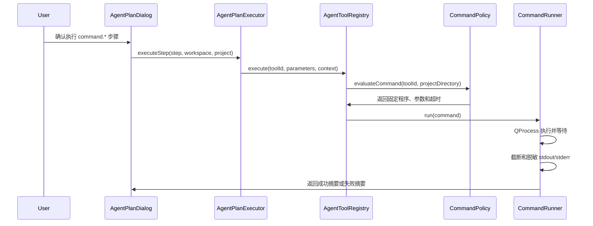

关键点：

- `command.*` 第一版不接受模型提供的任意参数。
- `CommandPolicy` 只允许固定模板，例如 `git status --short --branch`。
- 命令使用程序和参数数组执行，不通过 shell 字符串。
- 工作目录必须是安全目录，不能是磁盘根目录、系统目录或用户主目录根部。
- 命令输出可能包含不可信数据，日志只记录长度、退出码和超时状态。

## 16. 开发者命令技能流程

V9.1 开始，常见开发者命令组合被整理为技能目录。

相关模块：

- `AgentCommandSkillCatalog`
- `AgentPlanPromptBuilder`
- `AgentPlanParser`
- `AgentToolRegistry`

流程如下：

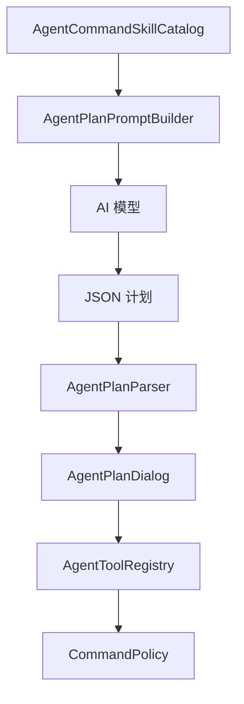

关键点：

- 技能只是推荐流程，不直接绕过确认。
- 技能会展开为普通 `command.*` 工具步骤。
- 执行时仍经过工具注册表、命令策略和命令运行器。
- 项目目录来自设置中的 Agent 项目目录，不再依赖应用启动目录。

## 17. 原生 Function Calling 计划流程

V9.2 开始，Agent 计划请求会优先携带 `AgentToolRegistry` 生成的 `tools` schema。

相关模块：

- `OpenAICompatibleClient`
- `StreamParser`
- `ToolCall`
- `AgentToolCallPlanBuilder`
- `ApplicationController`

流程如下：

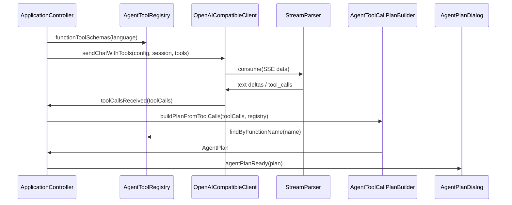

关键点：

- `tools` 来自本地工具注册表，不由模型自由声明。
- 函数名必须能映射回已注册工具 ID。
- `arguments` 必须是 JSON object。
- 没有返回 tool calls 时，仍走旧 JSON plan fallback。
- 如果服务商不兼容 tools 字段，控制层会退回不带 tools 的 JSON plan 请求一次。

## 18. 项目级指令流程

V10.1 开始，Agent 计划请求会读取项目目录根部的 `AGENT.md`。

相关模块：

- `ProjectInstructionService`
- `AgentPlanPromptBuilder`
- `ApplicationController`

流程如下：

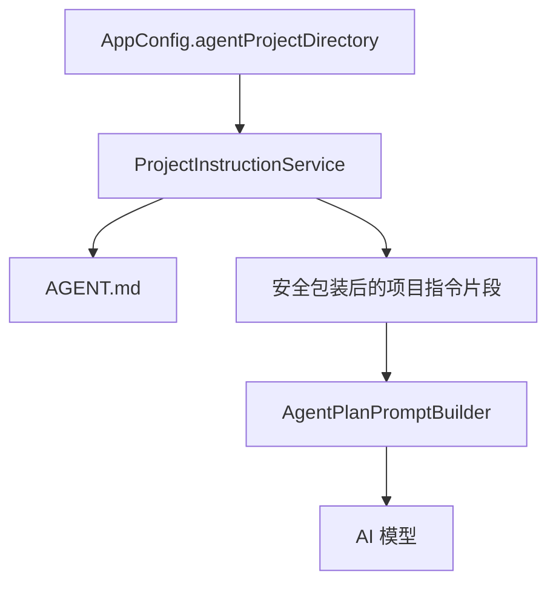

关键点：

- 缺少 `AGENT.md` 时静默跳过。
- 文件内容最大读取 16 KB。
- `AGENT.md` 是项目上下文，不是系统指令。
- 文件不能扩大工具权限、绕过确认或覆盖本地安全策略。

## 19. 外部技能文件流程

V10.2 开始，Agent 计划请求会读取项目目录下的 `skills/*.skill.md`。

相关模块：

- `AgentCommandSkillFileService`
- `AgentCommandSkillCatalog`
- `AgentPlanPromptBuilder`
- `ApplicationController`

流程如下：

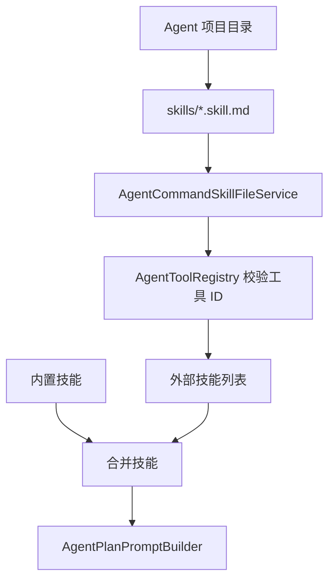

关键点：

- 技能文件只描述步骤模板，不直接执行。
- 外部技能重复 ID 不覆盖内置技能。
- 工具 ID 必须存在于工具注册表，并允许计划窗口直接执行。
- 命令工具仍受白名单策略限制。
- 当前读取项目目录根部 `skills` 文件夹，不递归读取子目录。

## 20. 受控工作记忆流程

V10.3 开始，Agent 可以读取项目记忆，并在用户确认后追加记忆。

相关模块：

- `ProjectMemoryService`
- `AgentToolRegistry`
- `AgentPlanPromptBuilder`
- `ApplicationController`

流程如下：

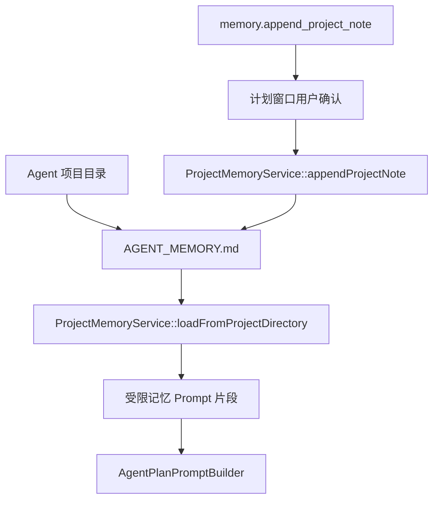

关键点：

- 不自动保存聊天全文。
- 不自动保存模型输出。
- 追加记忆必须走计划预览和用户确认。
- 明显包含凭据或密钥的内容会被拒绝。

---

## v1.0 新增流程（V12 - V18）

以下流程是项目从聊天客户端进化为桌面 Agent 平台后新增的关键能力。

## 21. Agentic Loop 全自动执行流程

V12 开始，Agent 循环进入连续 OODA 模式，最高支持 50 轮。

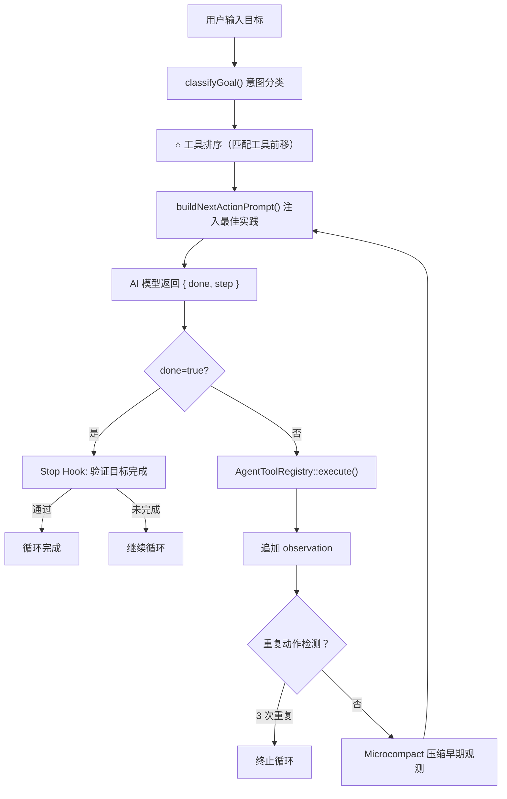

关键点：
- 每轮只执行一个工具步骤。
- 重复动作指纹检测：同 toolId + 同参数 3 次 → 终止。
- 上下文超限时触发 Reactive 压缩（压 50% observation → 重试 3 次）。
- 输出截断（finish_reason=length）自动续接。

## 22. 意图感知工具排序流程

V18.6 新增，让 AI 不会在 60 个工具中迷失。

```
classifyGoal("帮我改代码") → CodeEdit 意图
  ↓
reorderToolsByIntent() 
  → file.edit_text ⭐（排第 1）
  → file.read_text ⭐（排第 2）
  → command.bash  ⭐（排第 3）
  → ...
  → input.mouse_click（排最后，带软限制 30 个截断）
  ↓
buildToolGuidance()
  → "• file.edit_text: 精确替换...先用 old_str 定位再替换"
  → "• command.bash: 执行构建测试...用绝对路径"
```

7 种意图：CodeEdit / CodeSearch / BuildTest / FileManage / DesktopOp / WebRequest / ShellCmd。

## 23. AutoFix 自动修复闭环

V18.5 新增。Agent 编辑代码后自动触发：

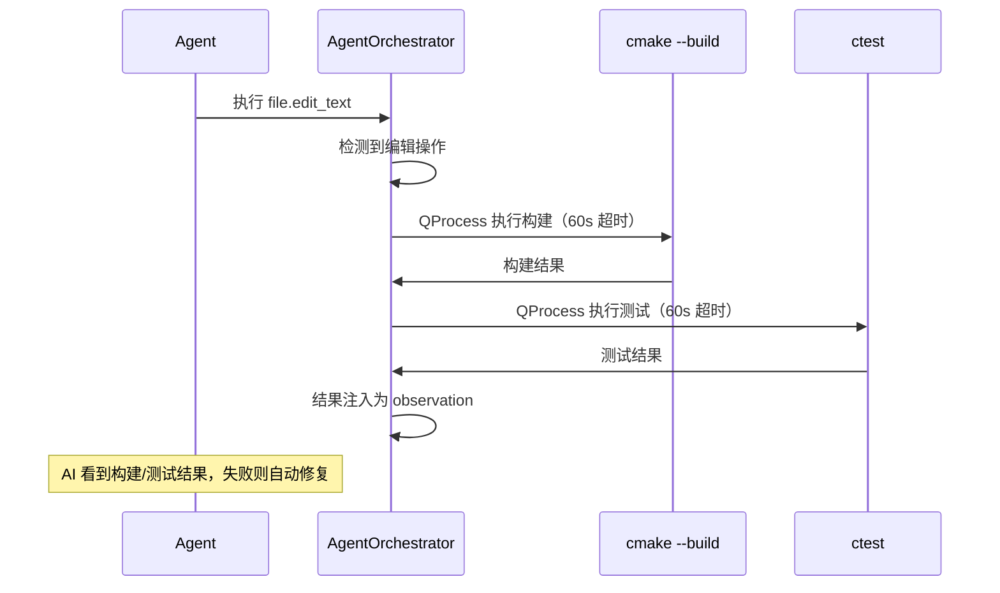

## 24. 三层记忆注入流程

V13.1+ 开始，Agent 循环每次都注入记忆。

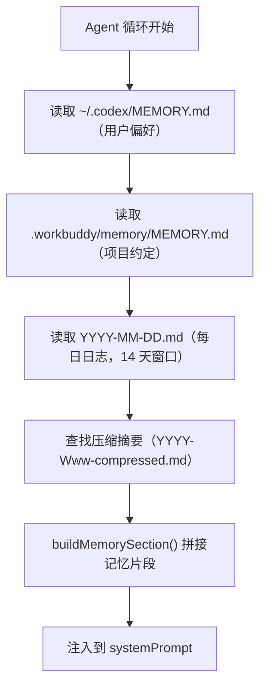

关键点：
- L1/L2 内容全量注入（体积可控）。
- L3 按 14 天窗口 + 50 条上限 + 30K 字符硬上限过滤。
- 14 天前的日志进入 ISO 周压缩（LLM 摘要 → `*-compressed.md`）。

## 25. Skill 匹配与注入流程

V13.3+ 开始，用户输入触发的 Skill 自动注入提示词。

```mermaid
flowchart TD
    Input["用户输入"全自动开发：改代码""] --> Match["SkillManager::matchSkills()"]
    Match --> Scan["扫描 ~/.workbuddy/skills/ + .workbuddy/skills/"]
    Scan --> Trigger["子串匹配触发词（"全自动开发"命中）"]
    Trigger --> Load["SkillFileParser 解析 SKILL.md"]
    Load --> Priority["按 priority 排序（100 > 0）"]
    Priority --> Inject["[Active Skills] 段注入 Agent 提示词"]
```

## 26. 桌面自动化闭环

Agent 操作桌面的完整认知-执行链条：

```
1. system.capture_screen      → 截图当前屏幕
2. system.ocr_text             → OCR 提取文字，定位坐标
3. system.active_control       → 获取当前焦点控件信息
4. input.validate_foreground   → 确认前台窗口正确
5. input.mouse_click(x, y)     → 点击目标位置
6. input.type_text("hello")    → 输入文本
7. system.get_selected_text    → Ctrl+C 获取结果
```

关键安全边界：
- 系统窗口黑名单（Task Manager / UAC / Ctrl+Alt+Del）。
- 禁止向密码域发送输入。
- 操作前必须校验前台窗口。
- 记忆文件只作为项目上下文，不能覆盖安全规则。
