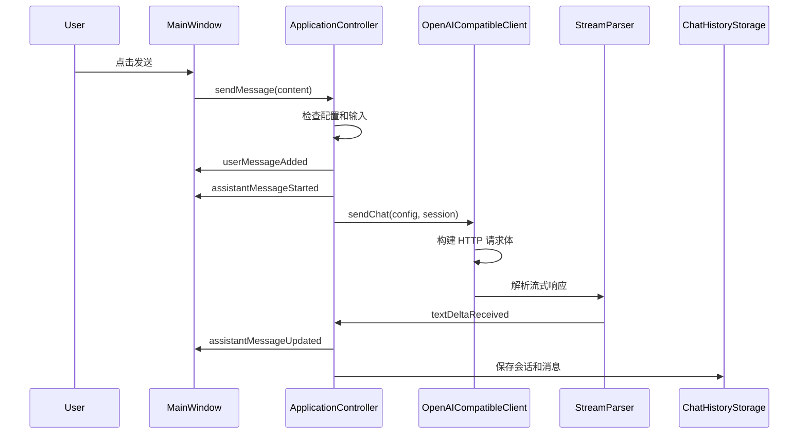
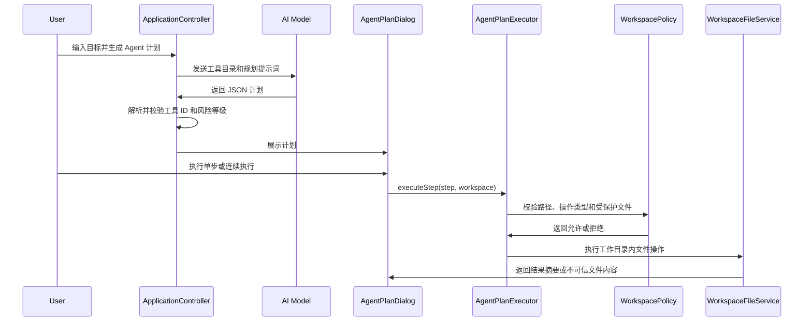
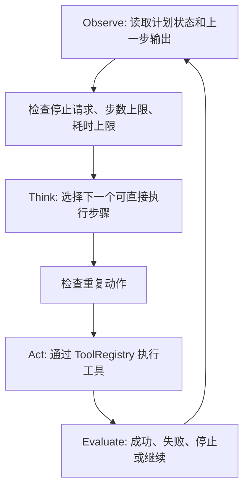
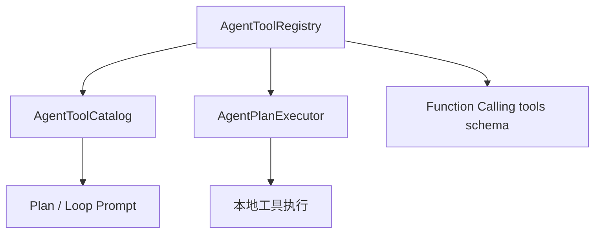

# 关键业务流程

本文从“用户做了什么，代码怎样响应”的角度介绍项目流程。建议对照 `src/ui/MainWindow.cpp`、`src/app/ApplicationController.cpp` 和 `src/services/OpenAICompatibleClient.cpp` 阅读。

## 1. 应用启动流程

入口在 `src/main.cpp`。

主要步骤：

1. 创建 `QApplication`。
2. 设置应用名称和组织名称。
3. 设置浅色主题和 QSS 样式。
4. 初始化 `AppLogger`。
5. 创建并显示 `MainWindow`。
6. 进入 Qt 事件循环。

`MainWindow` 构造时会：

1. 创建界面控件。
2. 连接信号槽。
3. 调用 `ApplicationController::initialize()`。
4. 加载配置、角色模板和最近会话。

## 2. 配置加载和 API Key 迁移

相关模块：

- `ConfigStorage`
- `CredentialStorage`
- `WindowsCredentialStorage`

加载配置时：

1. `ConfigStorage` 从 `QSettings` 读取非敏感配置。
2. 从 Windows Credential Manager 读取 API Key。
3. 如果 Credential Manager 没有 API Key，但旧 `QSettings` 里还有 `api/apiKey`：
   - 尝试写入 Windows Credential Manager。
   - 写入成功后删除旧 `api/apiKey`。
4. 返回运行时 `AppConfig`。

这个流程解决的是“历史版本可能已经把 API Key 写进普通配置”的兼容问题。

保存配置时：

1. Base URL、模型名、语言、模型参数继续保存到 `QSettings`。
2. API Key 单独保存到 Windows Credential Manager。
3. 如果 API Key 为空，则删除系统凭据中的旧值。

## 3. 发送消息流程

入口通常是 `MainWindow::sendCurrentMessage()`。



关键点：

- 用户消息会先加入当前会话。
- AI 回复会先创建一个空占位消息。
- 流式返回时不断更新最后一条 AI 消息。
- 请求完成后保存完整会话。

## 4. 流式响应解析

OpenAI 兼容接口通常返回 Server-Sent Events，格式类似：

```text
data: {"choices":[{"delta":{"content":"你好"}}]}

data: [DONE]
```

`StreamParser` 的职责是：

- 接收网络层分批到达的字节。
- 按 SSE 事件切分。
- 从 JSON 中取出增量文本。
- 识别 `[DONE]` 结束标记。

为什么需要单独解析器：

- 网络数据可能半包到达，一次 `readyRead` 不一定是一条完整消息。
- 解析逻辑可以独立测试。
- 服务层代码不会被字符串处理细节污染。

## 5. 停止生成流程

用户在生成中点击“停止”时：

1. `MainWindow::sendCurrentMessage()` 发现当前正在生成。
2. 调用 `ApplicationController::cancelCurrentRequest()`。
3. 控制层调用 `OpenAICompatibleClient::cancel()`。
4. 网络层 abort 当前 `QNetworkReply`。
5. 控制层把空 AI 回复更新为“已停止”。
6. 保存当前会话。

这个流程避免了用户必须等待长回复完成。

## 6. 失败重试流程

请求失败后：

1. `OpenAICompatibleClient` 根据 HTTP 状态码或网络错误生成错误分类。
2. `ApplicationController::handleRequestFailed()` 生成中英文友好提示。
3. 聊天区显示失败信息。
4. 控制层记录上一条用户消息。
5. 界面显示“重试”按钮。

点击重试时：

1. 控制层删除上一条失败的 AI 回复。
2. 重新创建 AI 回复占位。
3. 使用上一条用户消息重新发起请求。
4. 保存时使用 `replaceSessionMessages()`，避免数据库里残留旧失败回复。

## 7. 会话列表和排序

V3 修复过一个重要问题：点击会话导致列表顺序变乱。

设计原则：

- 只切换会话时，不应该改变排序。
- 会话内容真正更新时，才应该置顶。

相关模块：

- `SessionSummaryList`
- `ApplicationController::switchToSession()`
- `ApplicationController::saveCurrentSession(bool moveToTop)`

这类问题在真实产品中很常见，因为“读取”和“更新”如果没有区分清楚，就会产生用户觉得不稳定的行为。

## 8. 会话搜索流程

用户在左侧搜索框输入文本：

1. `MainWindow` 把文本传给 `ApplicationController::searchSessions()`。
2. 控制层调用 `ChatHistoryStorage::searchSessionSummaries()`。
3. SQLite 查询标题和消息内容。
4. 返回匹配的会话摘要。
5. 界面刷新会话列表。

当前使用 `LIKE` 查询，适合个人项目和中小数据量。大量历史记录时，可以考虑 SQLite FTS 全文索引。

## 9. Markdown 导出流程

用户点击导出：

1. 主窗口选择文件路径。
2. 控制层调用 `ChatSessionExporter::writeMarkdown()`。
3. 导出角色、时间和消息内容。
4. 时间使用 UTC+8 北京时间。
5. 文件不包含 API Key。

这是一个典型的“把业务数据转换成用户可读文件”的功能。

## 10. 日志查看流程

应用运行时通过 `AppLogger` 写日志。

日志窗口打开时：

1. `MainWindow` 创建 `LogViewerDialog`。
2. 对话框通过 `LogFileReader::readLastLines()` 读取最近 500 行。
3. 用户可以点击刷新。
4. 用户可以打开日志所在目录。

日志不记录：

- API Key。
- Bearer token。
- 请求体。
- 聊天正文。

这一点很重要，因为日志常用于排错，但不能泄露敏感信息。

## 11. 关闭窗口流程

曾经出现过“关闭窗口后 exe 仍被占用”的问题。

修复后的流程：

1. `MainWindow::closeEvent()` 检查是否正在生成。
2. 如果正在生成，先取消当前请求。
3. 接受关闭事件。
4. 调用 `QCoreApplication::quit()` 退出事件循环。

这个问题体现了桌面应用常见的资源释放意识：窗口消失不等于进程已经退出，网络请求、事件循环、后台对象都可能导致进程仍然存在。

## 12. Agent 工作目录文件流程

V8.1 开始，Agent 可以在默认工作目录内执行受控文件操作。

相关模块：

- `AgentPlanPromptBuilder`
- `AgentPlanParser`
- `AgentToolCatalog`
- `AgentPlanDialog`
- `AgentPlanExecutor`
- `WorkspacePolicy`
- `WorkspaceFileService`

流程如下：



关键点：

- AI 不能直接操作文件系统，只能返回结构化计划。
- 工具 ID 必须存在于本地 `AgentToolCatalog`。
- `workspace.write_text` 创建新文件，不覆盖已有文件。
- `workspace.overwrite_text` 覆盖前生成 `.bak` 备份。
- `workspace.delete_file` 把文件移动到 `.trash`，不是永久删除。
- `workspace.read_text` 会把文件内容包裹为不可信数据。
- 连续执行最多 5 步，任一步失败会暂停。

这个流程体现了 Agent 开发中的核心原则：模型负责建议，本地代码负责权限、路径和实际执行。

## 13. Agentic Loop 连续执行流程

V8.2 开始，计划窗口的连续执行不再自己维护循环，而是交给 `AgentLoopController`。

流程如下：



关键点：

- 每轮只执行一个工具步骤。
- 连续执行默认最多 5 步。
- 用户点击停止后，下一轮开始前会停止。
- 工具失败后不继续执行。
- 重复动作会被拦截。
- 日志记录 Observe、Think、Act、Evaluate 的摘要。

`AgentLoopPromptBuilder` 和 `AgentLoopActionParser` 预留给后续真实 AI 单步循环请求：模型每次只返回一个 action，或者返回 `done=true` 表示任务完成。

## 14. 工具注册表和 Function Calling 兼容流程

V8.3 开始，工具描述和执行函数统一放在 `AgentToolRegistry`。



注册表中的每个工具包含：

- 工具 ID。
- 中英文描述。
- 风险等级。
- 参数 schema。
- Function Calling 函数名。
- 是否允许计划窗口直接执行。
- 执行函数。

这样做的好处：

- Prompt 和执行器不会维护两份工具定义。
- 新增工具时主要改注册表。
- Function Calling schema 可以从同一份定义生成。
- 不支持直接执行的文件选择工具不会进入 Function Calling schema。
